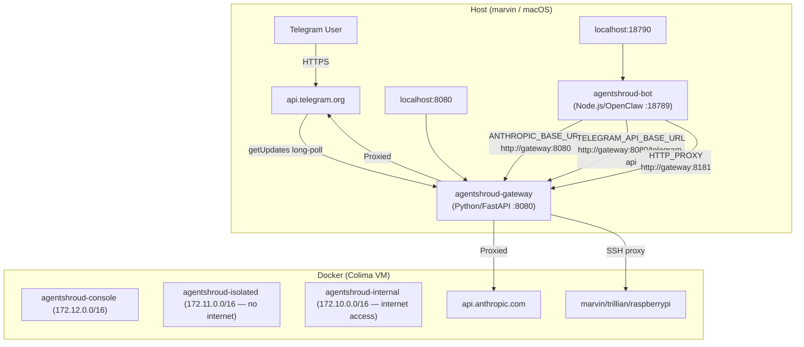

# Architecture Overview

## Component Map



## Every Major Component

| Component | Language | Port | Description | Note |
|-----------|----------|------|-------------|------|
| [[agentshroud-gateway]] | Python 3.13 / FastAPI | 8080 (ext), 8181 (CONNECT) | Security proxy, all inspection logic | Sole egress point |
| [[agentshroud-bot]] | Node.js 22 / OpenClaw | 18789 (int), 18790 (ext) | AI agent (Claude), user-facing | No direct internet |
| Telegram API | External | 443 | Bot messaging platform | Accessed via gateway |
| Anthropic API | External | 443 | LLM provider | Accessed via gateway |
| iMessage MCP | macOS host | 8200 | `mac-messages-mcp` bridge | `host.docker.internal:8200` |

## How Components Communicate

| Source | Destination | Protocol | Path |
|--------|-------------|----------|------|
| Telegram → Gateway | `agentshroud-gateway` | HTTPS long-poll | `/telegram-api/bot<token>/getUpdates` |
| Bot → LLM | `agentshroud-gateway` | HTTP/SSE | `/v1/messages` (Anthropic SDK) |
| Bot → Telegram | `agentshroud-gateway` | HTTP | `/telegram-api/bot<token>/<method>` |
| Bot → Telegram file DL | `agentshroud-gateway` | HTTP | `/telegram-api/file/bot<token>/<path>` |
| Bot → other HTTP | `agentshroud-gateway` | HTTP CONNECT | Port 8181 proxy |
| Gateway → MCP servers | `host.docker.internal` | HTTP/SSE | Port 8200 (iMessage), others |
| Gateway → SSH targets | `marvin`/`trillian`/`raspberrypi` | SSH | Port 22 |

## Data Stores and State

| Store            | Location                                | Purpose                               |
| ---------------- | --------------------------------------- | ------------------------------------- |
| Ledger DB        | `/app/data/ledger.db` (SQLite)          | Message audit trail, 90-day retention |
| Audit DB         | `/app/data/audit.db` (SQLite)           | SHA-256 hash chain audit entries      |
| Approval DB      | `/app/data/agentshroud_approvals.db`    | Pending action approvals              |
| Drift DB         | `/app/data/drift.db`                    | Config baseline snapshots             |
| Alert log        | `/tmp/security/alerts/alerts.jsonl`     | Security event log                    |
| Collaborator log | `/app/data/collaborator_activity.jsonl` | Per-user activity                     |
| Memory monitor   | `/app/data/memory-monitor/`             | SHA-256 file integrity baselines      |

## Network Topology

```
Internet
    │
    ├── api.telegram.org
    ├── api.anthropic.com
    └── other allowed domains (see agentshroud.yaml proxy.allowed_domains)
         │
    [agentshroud-internal 172.10.0.0/16]
         │
    ┌────┴──────────────────────────────┐
    │  agentshroud-gateway (:8080/:8181)│
    └────┬──────────────────────────────┘
         │
    [agentshroud-isolated 172.11.0.0/16]  ← no internet routing
         │
    ┌────┴──────────────────┐
    │  agentshroud-bot       │  ← hostname: "agentshroud"
    │  (:18789)              │
    └───────────────────────┘
```

The bot is **physically unable** to reach the internet — it only has `agentshroud-isolated` network which has no `gateway: default` route. All traffic must flow through the gateway's CONNECT proxy or named proxy endpoints.

## Ports Summary

| Port | Host Bound | Protocol | Service |
|------|-----------|----------|---------|
| 8080 | `127.0.0.1:8080` | HTTP | Gateway API (Telegram proxy, LLM proxy, management) |
| 8181 | Internal only | HTTP CONNECT | Egress CONNECT proxy for bot |
| 5353 | Internal only | UDP/TCP DNS | DNS forwarder with blocklist |
| 18789 | Internal | HTTP | Bot HTTP API (health, chat, webhook) |
| 18790 | `127.0.0.1:18790` | HTTP | Bot UI (forwarded from 18789) |

## Security Layers (in order applied)

1. **Network isolation** — bot on isolated network, no direct internet
2. **HTTP CONNECT proxy** — allowlist at port 8181
3. **Telegram API proxy** — MitM at `/telegram-api/`
4. **LLM proxy** — MitM at `/v1/`, streaming filter
5. **Security pipeline** — prompt injection, PII, trust, canary, encoding, egress
6. **Approval queue** — dangerous tools require human sign-off
7. **PII log sanitizer** — redacts from log output
8. **Memory integrity** — SHA-256 baseline monitoring

See [[Data Flow]] for how these layers apply to a real message.
