# Data Flow

## Full Message Lifecycle — Telegram → Bot → Response

```mermaid
flowchart TD
    USER["Telegram User\nsends message"] -->|HTTPS| TG_API["api.telegram.org"]
    TG_API -->|getUpdates long-poll\n200 OK + update| GW_TG["Gateway\nTelegram Proxy\n/telegram-api/"]

    GW_TG --> INBOUND["INBOUND PIPELINE\n(telegram_proxy.py)"]
    INBOUND --> PG["1. PromptGuard\nprompt injection scan"]
    PG -->|score < 0.8| PII_IN["2. PII Sanitizer\nredact SSN/CC/phone/email"]
    PG -->|score >= 0.8| BLOCK_IN["BLOCK\n403 returned to bot"]
    PII_IN --> TRUST["3. Trust Check\nagent trust level"]
    TRUST --> WEBHOOK["4. Forward to Bot\nPOST /webhook"]

    WEBHOOK --> BOT["agentshroud-bot\nOpenClaw processes message"]
    BOT -->|Anthropic SDK\nANTHROPIC_BASE_URL| GW_LLM["Gateway\nLLM Proxy\n/v1/messages"]

    GW_LLM --> LLM_REQ["LLM REQUEST PIPELINE\ninbound to Anthropic"]
    LLM_REQ --> ANTHRO["api.anthropic.com\n(via agentshroud-internal)"]
    ANTHRO -->|SSE streaming response| GW_LLM2["Gateway\nStreaming Filter"]

    GW_LLM2 --> OUTBOUND["OUTBOUND PIPELINE\n(pipeline.process_outbound)"]
    OUTBOUND --> PII_OUT["1. PII Sanitizer\nredact from LLM output"]
    PII_OUT --> INFO_FILT["2. OutboundInfoFilter\nblock architecture disclosure"]
    INFO_FILT --> CANARY["3. CanaryTripwire\ndetect canary string exfil"]
    CANARY --> ENC_DET["4. EncodingDetector\ndetect base64/homoglyph tricks"]
    ENC_DET --> EGRESS["5. EgressFilter\ndomain allowlist check"]
    EGRESS --> AUDIT["6. AuditChain\nSHA-256 hash + persist"]
    AUDIT -->|FORWARD| BOT_RESP["Bot receives LLM response"]
    AUDIT -->|BLOCK| SYNTH_SSE["Synthetic BLOCK SSE\nreturned to bot"]

    BOT_RESP --> TG_SEND["Bot calls sendMessage\nTELEGRAM_API_BASE_URL"]
    TG_SEND --> GW_TG_OUT["Gateway\nTelegram Proxy outbound"]
    GW_TG_OUT --> OUTBOUND2["OUTBOUND PIPELINE\n(outbound message scan)"]
    OUTBOUND2 -->|PASS| TG_API2["api.telegram.org\nsendMessage"]
    TG_API2 --> USER2["Telegram User\nreceives response"]
```



## Inbound Path (User → Bot)

1. **Telegram long-poll** — gateway polls `getUpdates` at `api.telegram.org`
2. **Telegram proxy receives update** — `telegram_proxy.py:proxy_request()`
3. **Owner vs Collaborator check** — `RBACConfig` determines role
   - Collaborator: command filtering, rate limit (200/hr), disclosure notice on first message
4. **PromptGuard scan** — score 0–1; block if ≥ 0.8, warn if ≥ 0.4
5. **PII sanitization** — Presidio redacts SSN, CC, phone, email, address from user message
6. **Forward to bot** — POST to `http://agentshroud:18789/webhook`

## Outbound Path — LLM Response (Bot → User via Anthropic)

1. **Bot calls Anthropic SDK** → `ANTHROPIC_BASE_URL=http://gateway:8080` → gateway `/v1/messages`
2. **LLM proxy** forwards request to `api.anthropic.com`, receives SSE stream
3. **Streaming filter buffers full SSE** — runs `pipeline.process_outbound()`
4. **PII sanitizer** — redacts from LLM output
5. **OutboundInfoFilter** — blocks internal architecture disclosure (hostnames, file paths, module names)
6. **CanaryTripwire** — detects if canary tokens appear in output (exfiltration indicator)
7. **EncodingDetector** — detects base64/homoglyph obfuscation in output
8. **EgressFilter** — domain allowlist check for any URLs in output
9. **AuditChain** — appends SHA-256 entry; persists BLOCK paths to SQLite
10. **BLOCK** → synthetic SSE replaces output; **REDACT** → sanitized delta rebuilds stream; **FORWARD** → original stream returned

## Outbound Path — Telegram Messages (Bot → User)

1. **Bot calls grammY SDK** → `TELEGRAM_API_BASE_URL=http://gateway:8080/telegram-api`
2. **Telegram proxy** receives outbound API call
3. **is_system=true** (startup/shutdown from start.sh via `X-AgentShroud-System: 1`) → skips filtering
4. **Otherwise:** outbound content scan (PII, PromptProtection, credential check)
5. **Forwarded** to `api.telegram.org` via gateway's internet connection

## Outbound Path — File Downloads (Photos)

1. **OpenClaw `downloadAndSaveTelegramFile()`** calls file download URL
2. **Pre-patch (broken):** `https://api.telegram.org/file/bot<token>/<path>` → timeout (bot is isolated)
3. **Post-patch (fixed):** `${TELEGRAM_API_BASE_URL}/file/bot<token>/<path>` → `http://gateway:8080/telegram-api/file/bot<token>/<path>`
4. Gateway regex matches `file/` prefix, proxies to `api.telegram.org/file/bot<token>/<path>`
5. File content returned to bot

See [[patch-telegram-sdk.sh]] and [[Photo Download Failure]] for context.

## Where Data Is Stored

| Stage | Where | How Long |
|-------|-------|---------|
| Raw messages | Ledger DB (`/app/data/ledger.db`) | 90 days (auto-delete) |
| Audit entries (hash chain) | Audit DB (`/app/data/audit.db`) | Until manually cleared |
| Pending approvals | Approval DB (`/app/data/agentshroud_approvals.db`) | Until acted on |
| Security alerts | `/tmp/security/alerts/alerts.jsonl` | Until container restart (tmpfs) |
| Collaborator activity | `/app/data/collaborator_activity.jsonl` | Persistent (gateway-data volume) |
| Session isolation | `/app/data/sessions/` | Per-session, managed by UserSessionManager |

## Approval Queue Flow

```
Bot requests dangerous action (exec/cron/external API)
    │
    ▼
ApprovalQueue.submit()
    │
    ├── Telegram notification → owner (admin_chat_id)
    ├── Stored in approval DB
    └── Bot waits (timeout: 1 hour, action: deny)
         │
         ├── Owner sends /approve <id> → action proceeds
         └── Timeout → action denied
```
