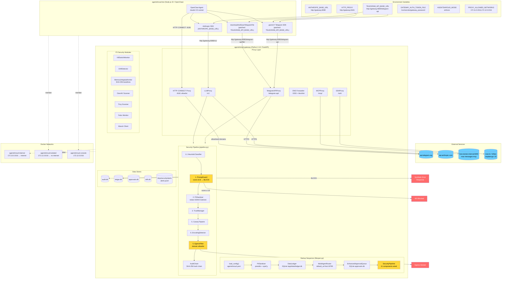

a---
title: Full System Flowchart
type: index
tags: [#type/index, #status/active]
related: ["[[Architecture Overview]]", "[[Data Flow]]", "[[Startup Flow Diagram]]"]
status: active
last_reviewed: 2026-03-09
---

# Full System Flowchart

## Legend

| Color | Meaning |
|-------|---------|
| Yellow | Critical security components |
| Blue | External services |
| Red | Error/block paths |
| White | Normal operation |

## Key Flows

1. **Telegram message in:** User → `api.telegram.org` → Gateway TelegramAPIProxy → Pipeline (inbound) → Bot `/webhook`
2. **LLM call:** Bot Anthropic SDK → Gateway LLMProxy → `api.anthropic.com` → Streaming filter → Pipeline (outbound) → Bot
3. **Telegram message out:** Bot grammY → Gateway TelegramAPIProxy → Pipeline (outbound) → `api.telegram.org`
4. **File download:** Bot `downloadAndSaveTelegramFile` → Gateway TelegramAPIProxy `/telegram-api/file/` → `api.telegram.org/file/` → Bot
5. **Other HTTP:** Bot → CONNECT proxy `:8181` → allowlist check → destination (if allowed)
