# Startup Flow Diagram

```mermaid
flowchart TD
    START(["docker compose up -d"]) --> GW_START["agentshroud-gateway\ncontainer starts"]

    GW_START --> OP_AUTH["1Password Auth\n(background thread)"]
    GW_START --> LOAD_CFG["load_config()\nagentshroud.yaml"]

    LOAD_CFG -->|"FileNotFoundError"| CFG_FAIL(["FATAL: Exit\nCheck volume mount"]):::error
    LOAD_CFG -->|"ValueError"| CFG_FAIL
    LOAD_CFG -->|"OK"| PII_INIT

    PII_INIT["PIISanitizer\npresidio + en_core_web_lg"] -->|"ImportError\nModel missing"| PII_FAIL(["FATAL: Exit\nRebuild image"]):::error
    PII_INIT -->|"OK"| LEDGER_INIT

    LEDGER_INIT["DataLedger\nSQLite /app/data/ledger.db"] -->|"SQLite error"| LED_FAIL(["FATAL: Exit\nCheck gateway-data volume"]):::error
    LEDGER_INIT -->|"OK"| ROUTER_INIT

    ROUTER_INIT["MultiAgentRouter\nregister_bots()"] --> AGENT_REG["AgentRegistry\nIsolationVerifier\nverify_shared_nothing()"]
    AGENT_REG --> APPROVAL_INIT

    APPROVAL_INIT["EnhancedApprovalQueue\nbot_token + owner_chat_id"] -->|"Error"| AQ_FAIL(["FATAL: Exit\nCheck telegram_bot_token secret"]):::error
    APPROVAL_INIT -->|"OK"| SEC_INIT

    SEC_INIT["Security Components\nPromptGuard + HeuristicClassifier\nTrustManager + EgressFilter\nMiddlewareManager + OutboundFilter\nPromptProtection"] --> AUDIT_INIT

    AUDIT_INIT["AuditStore\n/app/data/audit.db\n→ wire into EgressFilter"] --> PIPELINE_INIT

    PIPELINE_INIT["SecurityPipeline\n11 guards assembled"] --> LLM_INIT

    LLM_INIT["LLMProxy\npipeline + middleware_manager"] --> SESSION_INIT

    SESSION_INIT["UserSessionManager\nCollaboratorActivityTracker"] --> P3_INIT

    P3_INIT["P3 Infrastructure\nAlertDispatcher\nKillSwitchMonitor\nDriftDetector\nMemoryIntegrityMonitor\nMemoryLifecycleManager\nClamAV + Trivy\nFalco + Wazuh\nNetworkValidator"] --> MCP_INIT

    MCP_INIT["MCPProxy\nagentshroud.yaml mcp_proxy:"] --> SSH_INIT

    SSH_INIT{"ssh.enabled?"} -->|"yes"| SSH_START["SSHProxy\nkey: /var/agentshroud-ssh"]
    SSH_INIT -->|"no"| HTTP_PROXY_INIT
    SSH_START --> HTTP_PROXY_INIT

    HTTP_PROXY_INIT["HTTP CONNECT Proxy\n:8181 allowlist"] -->|"Port in use"| HTTP_WARN["Warning: continue\nBot egress partially broken"]:::warn
    HTTP_PROXY_INIT -->|"OK"| DNS_INIT
    HTTP_WARN --> DNS_INIT

    DNS_INIT["DNS Forwarder\n:5353 + DNSBlocklist\ndownload adlists"] -->|"Port in use"| DNS_WARN["Warning: continue"]:::warn
    DNS_INIT -->|"OK"| HEARTBEAT
    DNS_WARN --> HEARTBEAT

    HEARTBEAT["AuditChain heartbeat\nasyncio task, 60s interval"] --> READY

    READY(["Gateway READY\n127.0.0.1:8080\nHealthcheck passes"]) --> BOT_START

    BOT_START["agentshroud-bot\ndepends_on: gateway healthy"] --> READ_SECRETS

    READ_SECRETS["Read Docker Secrets\nOPENCLAW_GATEWAY_PASSWORD_FILE\nTELEGRAM_BOT_TOKEN_FILE"] -->|"File not found"| SEC_FAIL(["Bot crashes\nCheck secrets dir"]):::error
    READ_SECRETS -->|"OK"| INIT_CONFIG

    INIT_CONFIG["init-config.sh\nWrite openclaw.json\nif not present"] --> APPLY_PATCHES

    APPLY_PATCHES["apply-patches.js\nModel, maxTokens, denied tools\nworkspace path, collaborator settings"] --> OPENCLAW_START

    OPENCLAW_START["openclaw start\nInitialize Telegram long-poll\ngetUpdates..."] -->|"Token invalid"| TG_FAIL(["Bot crashes\nCheck telegram token"]):::error
    OPENCLAW_START -->|"OK"| STARTUP_NOTIF

    STARTUP_NOTIF["startup notification\ncurl -H 'X-AgentShroud-System: 1'\nPOST /telegram-api/bot.../sendMessage\n→ bypasses content filter"] --> BOT_READY

    BOT_READY(["Bot READY\nTelegram long-poll active\nHealthcheck passes"])

    %% Styles
    classDef error fill:#ff6b6b,color:#fff,font-weight:bold
    classDef warn fill:#ffd93d,color:#000
    classDef ready fill:#6bcb77,color:#000,font-weight:bold

    class CFG_FAIL,PII_FAIL,LED_FAIL,AQ_FAIL,SEC_FAIL,TG_FAIL error
    class HTTP_WARN,DNS_WARN warn
    class READY,BOT_READY ready
```



## Critical Path Summary

```
load_config() → PIISanitizer → DataLedger → ApprovalQueue → SecurityPipeline → LLMProxy → [READY]
                                                                                              ↓
                                                                                           Bot starts
                                                                                              ↓
                                                                                 apply-patches.js → openclaw start → [BOT READY]
```

Any red node → gateway or bot exits. Check [[Gateway Startup Failure]] for remediation per node.
