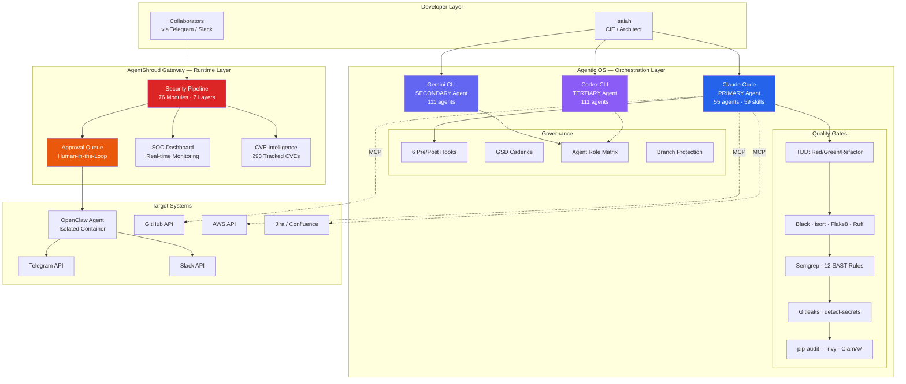
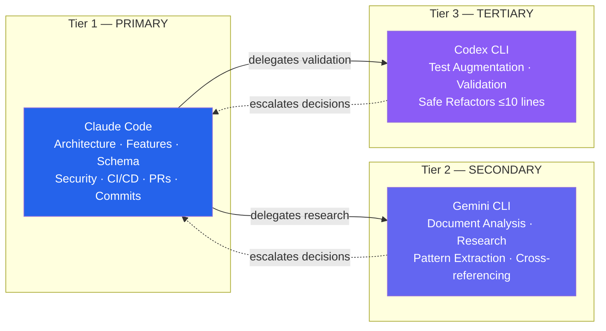
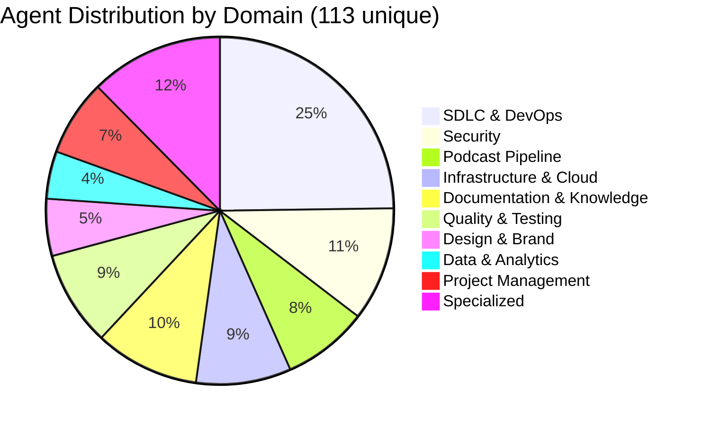
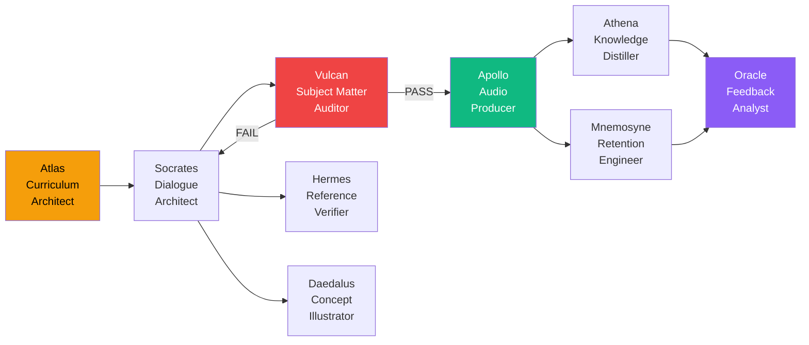
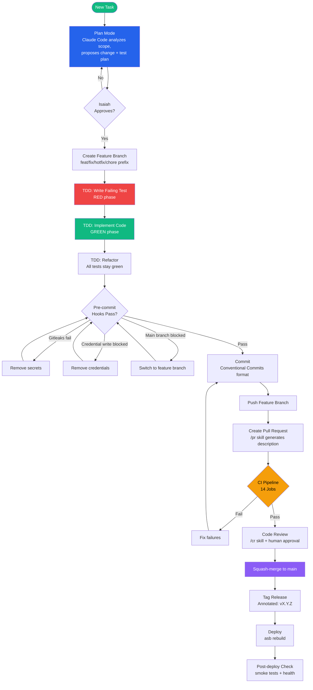
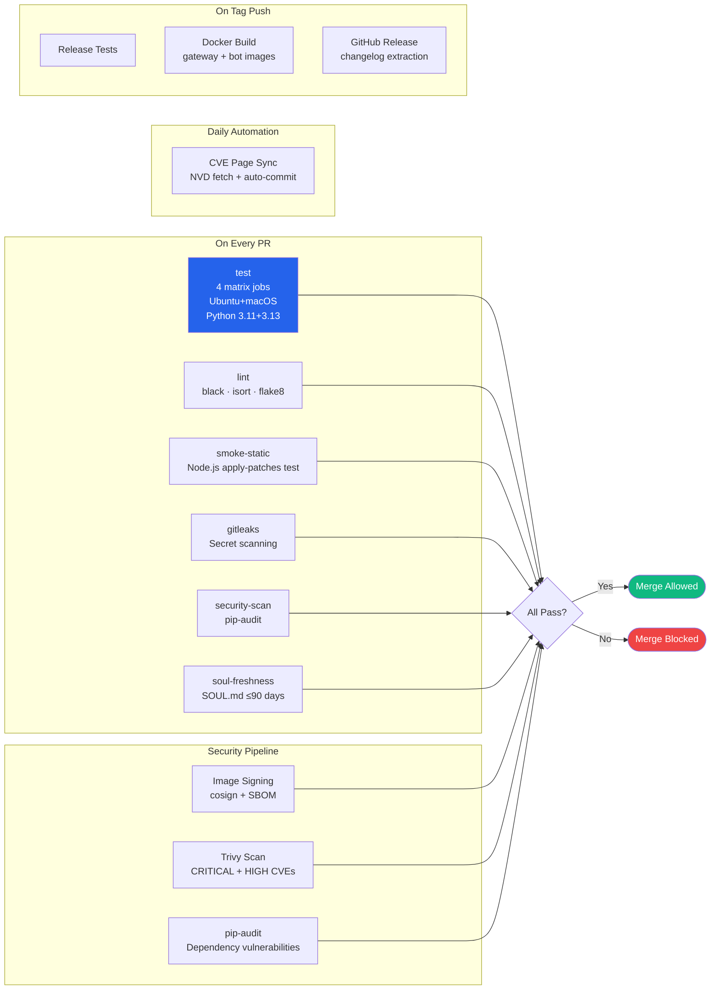
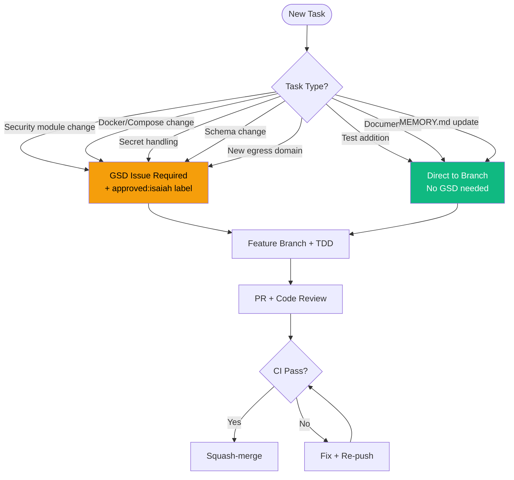
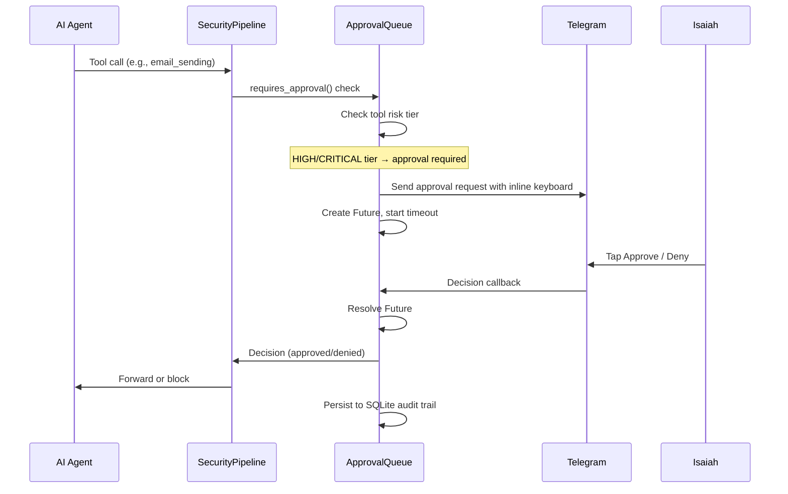
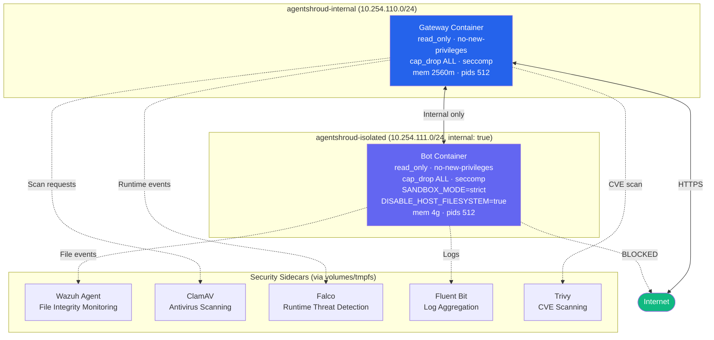

# AgentShroud Agentic OS

## AI-Native Development Framework

**Version:** 1.0.59 | **Updated:** 2026-04-14 | **Author:** Isaiah Dallas Jefferson, Jr.

AgentShroud operates as an **Agentic Operating System (AOS)** — an AI-native software
layer that orchestrates autonomous AI agents across the full software development
lifecycle. Rather than using AI as an assistant, AgentShroud treats AI agents as
first-class team members with defined roles, formal governance, automated guardrails,
and human-in-the-loop oversight at every decision point.

This document describes the complete orchestration architecture: the agent hierarchy,
the 59 skills that encode team expertise, the 7-layer security pipeline, the CI/CD
quality gates, and the governance model that keeps it all accountable.

---

## Table of Contents

1. [System Overview](#1-system-overview)
2. [Multi-Agent Hierarchy](#2-multi-agent-hierarchy)
3. [Agent Inventory](#3-agent-inventory)
4. [Skill System](#4-skill-system)
5. [Orchestration Flow](#5-orchestration-flow)
6. [Security Pipeline](#6-security-pipeline)
7. [CI/CD Quality Gates](#7-cicd-quality-gates)
8. [Governance Model](#8-governance-model)
9. [Human-in-the-Loop Controls](#9-human-in-the-loop-controls)
10. [Infrastructure & Runtime](#10-infrastructure--runtime)
11. [Automated Operations](#11-automated-operations)
12. [MCP Integrations](#12-mcp-integrations)
13. [Compliance Alignment](#13-compliance-alignment)
14. [Gap Analysis & Recommendations](#14-gap-analysis--recommendations)

---

## 1. System Overview



### Key Numbers

| Metric | Value |
|--------|-------|
| AI Agent Platforms | 3 (Claude Code, Gemini CLI, Codex CLI) |
| Unique Agent Definitions | 113 |
| Encoded Skills | 59 + 5 runtime skills |
| Security Modules | 76 across 7 layers |
| Pre/Post Tool Hooks | 7 (across 6 shell scripts) |
| CI/CD Jobs | 14 (across 6 workflows) |
| Semgrep SAST Rules | 12 custom rules (10 CWEs) |
| Tracked CVEs | 293 (100% mitigated) |
| Test Coverage | 94%+ (3,700+ tests) |
| Cron Automations | 11 scheduled jobs |
| MCP Integrations | 5 servers (GitHub, Atlassian, AWS, XMind x2) |
| Compliance Standards | 8 frameworks referenced |

---

## 2. Multi-Agent Hierarchy

AgentShroud uses a **three-tier agent hierarchy** with strict role boundaries,
enforced by governance documents and runtime hooks.



### Authorization Matrix

| Task | Claude | Gemini | Codex |
|------|--------|--------|-------|
| Architecture decisions | **Own** | Defer | Defer |
| New feature implementation | **Own** | Defer | Defer |
| Bug fixes | **Own** | Defer | Defer |
| Schema / API changes | **Own** | Defer | Defer |
| Security module changes | **Own** | Blocked | Blocked |
| Large refactors | **Own** | Defer | Defer |
| Docker / Compose changes | **Own** | Blocked | Blocked |
| CI/CD pipeline changes | **Own** | Blocked | Blocked |
| Git commits / PRs | **Own** | Blocked | Blocked |
| Secret handling | **Own** | Blocked | Blocked |
| Test augmentation | Own | **Own** | **Own** |
| Validation runs | Own | **Own** | **Own** |
| Document analysis | Own | **Own** | Support |
| Small safe refactors (<10 lines) | Own | **Own** | **Own** |

### Configuration Locations

| Agent | Config Directory | Instruction File |
|-------|-----------------|------------------|
| Claude Code | `.claude/` | `CLAUDE.md` |
| Gemini CLI | `.gemini/` | `.gemini/GEMINI.md` |
| Codex CLI | `.codex/` | `.codex/AGENTS.md` |

### Security-Sensitive Paths (Claude-Only)

These paths are blocked for Gemini/Codex regardless of task type:

- `gateway/security/**` — all 76 security modules
- `gateway/approval_queue/**` — human-in-the-loop queue
- `docker/setup-secrets.sh` — secret extraction pipeline
- `docker/config/openclaw/apply-patches.js` — runtime config patches
- `.claude/scripts/claude-hooks/` — enforcement hooks
- `.claude/settings.json` — agent configuration

---

## 3. Agent Inventory

### Distribution by Platform

| Platform | Total Agents | Shared | Platform-Exclusive |
|----------|-------------|--------|-------------------|
| Claude Code | 55 | 53 | 2 (`testrunner`, `doc-writer`) |
| Gemini CLI | 111 | 53 | 58 (mirrors skills as agents) |
| Codex CLI | 111 | 53 | 58 (mirrors Gemini set) |

### Agents by Domain



### Podcast Pipeline — Greek Mythology Agents

A self-contained content pipeline for educational podcast production:



| Agent | Role | Key Output |
|-------|------|------------|
| **Atlas** | Curriculum Architect | Bloom's Taxonomy learning objectives |
| **Socrates** | Dialogue Architect | HOST/EXPERT two-person dialogue scripts |
| **Vulcan** | Subject Matter Auditor | PASS/FAIL quality gate with technical accuracy review |
| **Apollo** | Audio Systems Producer | ElevenLabs v3 audio (44100Hz/128kbps) |
| **Hermes** | Reference Verifier | Fact-checked URLs, pinned versions, free/official sources |
| **Daedalus** | Concept Illustrator | PlantUML and Mermaid diagrams |
| **Athena** | Knowledge Distiller | show_notes.md and cheatsheet.md |
| **Mnemosyne** | Retention Engineer | Spaced repetition cues (Day 1/3/7/30) |
| **Oracle** | Feedback Analyst | Quality scores 1-10, coverage gaps, engagement analysis |

---

## 4. Skill System

Skills are encoded expertise — reusable, invocable procedures that any agent can
trigger via `/skill-name`. Each skill is a `SKILL.md` file that defines the procedure,
constraints, and expected output format.

### 59 Skills by Category

| Category | Count | Skills |
|----------|-------|--------|
| **Podcast Pipeline** | 9 | atlas, socrates, vulcan, apollo, hermes, daedalus, athena, mnemosyne, oracle |
| **Dev Lifecycle** | 18 | tdd, cr, qa, pr, gg, ci, cd, cicd, ps, mc, gitops, bdd, sdlc, agile, scrum, kanban, kaizen, production |
| **Security** | 3 | sec, sec-defense, sec-offense |
| **Infrastructure** | 5 | aws, sre, observability, chaos-engineering, devsecops |
| **MCP Integration** | 4 | mcpm, mcpm-doctor, mcpm-auth-reset, mcpm-aws-profile |
| **Documentation** | 6 | sad, sav, tw, ti, mm, session-prompt |
| **Design & Brand** | 3 | bs, ui, ux |
| **Specialized** | 11 | 8d, browser, icloud, mac, competitive-analysis, pm, data, incident-response, value-stream-mapping, architecture-review, env |

### Key Skills in Detail

#### `/tdd` — Test-Driven Development Coach
Enforces strict Red/Green/Refactor cycle. Every behavior change requires:
1. **RED** — write the smallest failing test
2. **GREEN** — implement minimum code to pass
3. **REFACTOR** — improve clarity, all tests stay green

Coverage floor: **94%** on new or modified code.

#### `/gg` — Git Workflow Guardian
Enforces branch naming conventions, protected `main`, PR workflow with mandatory
code review, Conventional Commit messages, and emergency hotfix procedures.

#### `/sec-offense` — Red Team Adversarial Tester
Writes exploit proof-of-concepts as pytest tests. Simulates attacks through
Telegram/gateway API. Tests prompt injection, privilege escalation, data exfiltration.

#### `/sec-defense` — Blue Team STPA-Sec Auditor
Uses Systems-Theoretic Process Analysis for security. Categorizes losses L-1
through L-4. Produces heat map verification of defense coverage.

#### `/cr` — Code Review
Security-critical review with 400-line PR rule, OWASP/CWE checks, and explicit
sign-off requirements.

---

## 5. Orchestration Flow

### Development Workflow — End to End



### Hook Enforcement Layer

Every tool invocation passes through hooks before execution:

```mermaid
flowchart LR
    subgraph "PreToolUse Hooks"
        H1[warn_dangerous_bash.sh<br/>rm -rf, curl|sh, chmod 777]
        H2[block_main_commits.sh<br/>No commits on main]
        H3[block_credential_read.sh<br/>No cat/grep on secrets/]
        H4[block_credential_write.sh<br/>No xoxb-, ghp_, sk-, AKIA]
    end

    subgraph "PostToolUse Hooks"
        H5[auto_format_python.sh<br/>ruff + black auto-fix]
        H6[run_targeted_tests.sh<br/>Auto-test changed files]
    end

    TOOL[Agent Tool Call] --> H1 --> H2 --> H3 --> H4 --> EXEC[Execute]
    EXEC --> H5 --> H6 --> DONE[Complete]

    style H2 fill:#ef4444,color:#fff
    style H3 fill:#ef4444,color:#fff
    style H4 fill:#ef4444,color:#fff
    style H5 fill:#10b981,color:#fff
    style H6 fill:#10b981,color:#fff
```

| Hook | Type | Action | Trigger |
|------|------|--------|---------|
| `warn_dangerous_bash.sh` | PreToolUse | **Warn** | `rm -rf /`, `curl\|sh`, `chmod -R 777`, `dd if=`, fork bombs |
| `block_main_commits.sh` | PreToolUse | **Block** | `git commit/push/merge/rebase` on `main` branch |
| `block_credential_read.sh` | PreToolUse | **Block** | `cat/head/tail/grep` on `docker/secrets/`, `.env` files |
| `block_credential_write.sh` | PreToolUse | **Block** | Writing Slack `xoxb-`/`xapp-`, GitHub `ghp_`, OpenAI `sk-`, AWS `AKIA`, JWTs |
| `auto_format_python.sh` | PostToolUse | **Auto-fix** | Runs `ruff check --fix` + `black` on modified Python files |
| `run_targeted_tests.sh` | PostToolUse | **Auto-test** | Runs `pytest` on test files matching changed source files |

---

## 6. Security Pipeline

### 7-Layer Defense Architecture

Every message between the AI agent and external systems passes through the
SecurityPipeline — a chain of 76 modules organized into 7 layers.

```mermaid
flowchart TB
    MSG_IN([Inbound Message]) --> L1

    subgraph L1["Layer 1 — Core Pipeline (P0)"]
        S0[Step 0: ContextGuard<br/>Cross-turn injection detection]
        S1[Step 1: PromptGuard<br/>Injection scoring]
        S1_1[Step 1.1: HeuristicClassifier<br/>Secondary injection signal]
        S1_5[Step 1.5: ToolResultInjectionScanner<br/>12 injection rules + encoding detection]
        S1_6[Step 1.6: XMLLeakFilter<br/>C32 shell metacharacter patterns]
        S2[Step 2: PII Sanitizer<br/>Presidio engine @ 0.9 confidence]
        S2_5[Step 2.5: ClamAV<br/>Malware scanning]
        S3[Step 3: TrustManager<br/>Progressive trust scoring]
        S4[Step 4: ApprovalQueue<br/>Human-in-the-loop gate]
        S5[Step 5: AuditChain<br/>SHA-256 tamper-evident log]

        S0 --> S1 --> S1_1 --> S1_5 --> S1_6 --> S2 --> S2_5 --> S3 --> S4 --> S5
    end

    S5 --> AGENT([AI Agent])

    AGENT --> OUT_S0

    subgraph L1_OUT["Layer 1 — Outbound Pipeline"]
        OUT_S0[Step 0: XML Block Strip<br/>Remove internal thinking tags]
        OUT_S1[Step 1: PII Sanitizer]
        OUT_S1_5[Step 1.5: OutboundInfoFilter<br/>Credential + hostname leak prevention]
        OUT_S1_55[Step 1.55: PromptProtection<br/>System prompt disclosure block]
        OUT_S1_6[Step 1.6: EncodingDetector<br/>Base64/hex/unicode bypass detection]
        OUT_S1_7[Step 1.7: CanaryTripwire<br/>Planted token detection — hard block]
        OUT_S1_75[Step 1.75: ToolResultSanitizer<br/>Exfiltration pattern stripping]
        OUT_S1_76[Step 1.76: PromptGuard.scan_tool_result<br/>Indirect injection in tool outputs]
        OUT_S1_8[Step 1.8: OutputCanary<br/>Leaked canary token detection]
        OUT_S1_9[Step 1.9: OutputSchemaEnforcer<br/>Schema validation]
        OUT_S2[Step 2: EgressFilter<br/>Domain/port policy enforcement]
        OUT_S3[Step 3: AuditChain]

        OUT_S0 --> OUT_S1 --> OUT_S1_5 --> OUT_S1_55 --> OUT_S1_6 --> OUT_S1_7
        OUT_S1_7 --> OUT_S1_75 --> OUT_S1_76 --> OUT_S1_8 --> OUT_S1_9 --> OUT_S2 --> OUT_S3
    end

    OUT_S3 --> RESPONSE([Response to User])

    style S0 fill:#dc2626,color:#fff
    style S1 fill:#dc2626,color:#fff
    style S2 fill:#ea580c,color:#fff
    style S4 fill:#f59e0b,color:#000
    style S5 fill:#6366f1,color:#fff
    style OUT_S1_7 fill:#dc2626,color:#fff
```



### Module Count by Layer

| Layer | Name | Module Count | Key Modules |
|-------|------|-------------|-------------|
| L1 | Core Pipeline (P0) | 5 | PromptGuard, TrustManager, EgressFilter, PII Sanitizer, Gateway Binding |
| L2 | Middleware (P1) | 17 | SessionManager, TokenValidator, ConsentFramework, SubagentMonitor, RBAC, ToolACL, ContextGuard, EncodingDetector, HeuristicClassifier, ApprovalHardening, BrowserSecurity |
| L3 | Output Protection | 10 | OutboundFilter, OutputCanary, OutputSchema, MultiTurnTracker, LogSanitizer, MetadataGuard, ToolResultSanitizer, ToolResultInjection, XmlLeakFilter, PromptProtection |
| L4 | Tool & Agent Control | 6 | ToolACL, ToolChainAnalyzer, ToolResultSanitizer, InstructionEnvelope, SubagentMonitor, ProgressiveLockdown |
| L5 | Network & Egress | 6 | EgressFilter, EgressApproval, EgressMonitor, DNSFilter, NetworkValidator, WebContentScanner |
| L6 | File & Memory Integrity | 8 | FileSandbox, PathIsolation, DriftDetector, MemoryIntegrity, MemoryLifecycle, GitGuard, EnvGuard, ConfigIntegrity |
| L7 | Infrastructure & Supply Chain | 14 | ImageVerifier (cosign), ClamAV, Trivy, Falco, Wazuh, EncryptedStore, KeyVault, KeyRotation, HealthReport, AlertDispatcher, CanaryTripwire, SOCCorrelation, ScannerIntegration, KillswitchMonitor |
| | **Total** | **76** | |

### Proxy Layer

The gateway intercepts all agent communication through specialized proxies:

| Proxy | Port | Purpose |
|-------|------|---------|
| Telegram API Proxy | 8080 `/telegram-api/` | Bot API interception, PII/injection scanning, media size limits |
| Slack API Proxy | 8080 `/slack-api/` | Web API interception, Socket Mode event processing |
| LLM Proxy | 8080 `/llm/` | Anthropic/OpenAI/Google/Ollama interception, credential blocking |
| HTTP CONNECT Proxy | 8181 | All outbound HTTP/HTTPS tunnel with domain allowlist |
| Canvas Auth Proxy | 18789 | HTTP Basic Auth gate for OpenClaw Control UI (CVE-2026-34871) |
| SSH Proxy | 8181 | SSH command execution with metacharacter injection blocking |
| MCP Proxy | 8080 `/mcp/` | MCP tool call interception, permission enforcement, audit trail |
| DNS Forwarder | 5353 | Pi-hole-style DNS filtering with periodic blocklist updates |
| Web Proxy | 8080 `/web/` | SSRF hard block, content scanning, URL analysis |

---

## 7. CI/CD Quality Gates

### Pipeline Overview



### 6 CI Workflows, 14 Jobs

| Workflow | Jobs | Trigger |
|----------|------|---------|
| `ci.yml` | test (4x matrix), lint, gitleaks, smoke-static, security-scan, soul-freshness | Push/PR to main |
| `security-scan.yml` | image-signing (cosign+SBOM), trivy-scan (SARIF), pip-audit | Push/PR to main |
| `release.yml` | test, docker-build-push, github-release | Tag push `v*` |
| `pages.yml` | deploy (GitHub Pages) | Push to main (docs changes) |
| `block-destructive-branch.yml` | check-source-branch | PR to main |
| `update-cve-page.yml` | sync-and-update (NVD fetch) | Daily 11:30 UTC + push to main |

### Pre-commit Hook Chain

Before any commit reaches CI, local hooks enforce:

| Order | Tool | What it Checks |
|-------|------|----------------|
| 1 | **gitleaks** | Secrets in staged changes |
| 2 | **detect-secrets** (Yelp) | Advanced credential patterns with baseline |
| 3 | **check-added-large-files** | Files > 10MB blocked |
| 4 | **detect-private-key** | RSA/DSA/ECDSA private keys |
| 5 | **detect-aws-credentials** | AWS access keys |
| 6 | **check-yaml / check-json** | Syntax validation |
| 7 | **check-merge-conflict** | Unresolved conflict markers |
| 8 | **ruff** | Python lint with auto-fix |
| 9 | **black** | Python formatting |
| 10 | **semgrep** | 12 SAST rules in `--error` mode |

### Semgrep SAST Rules

| Rule | Severity | CWE | Detects |
|------|----------|-----|---------|
| `subprocess-shell-true` | ERROR | CWE-78 | Command injection via `shell=True` |
| `subprocess-unvalidated-input` | WARNING | CWE-78 | Unvalidated subprocess arguments |
| `path-traversal-open` | WARNING | CWE-22 | User-controlled path in `open()` |
| `hardcoded-password` | ERROR | CWE-798 | Hardcoded secrets in variables |
| `ssrf-httpx` | WARNING | CWE-918 | SSRF via httpx with dynamic URLs |
| `ssrf-requests` | WARNING | CWE-918 | SSRF via requests library |
| `pickle-load` | ERROR | CWE-502 | Insecure deserialization |
| `assert-security-check` | WARNING | CWE-617 | `assert` used for security checks |
| `sql-injection` | ERROR | CWE-89 | SQL injection via string formatting |
| `log-sensitive-key` | WARNING | CWE-532 | Logging tokens/passwords |

---

## 8. Governance Model

### "Get Shit Done" (GSD) Cadence

A lightweight governance model that prioritizes shipping real work over process
theater, while maintaining strict gates on production-impacting changes.



### Recurring Governance Rituals

| Ritual | Schedule | Skill | Purpose |
|--------|----------|-------|---------|
| Weekly Kaizen | Friday 17:00 ET | `/kaizen` | Continuous improvement review |
| Monthly Chaos Drill | 1st of month 09:00 ET | `/chaos-engineering monthly-drill` | Failure injection and resilience testing |

### Branch Protection (belt-and-suspenders)

| Enforcement Point | Mechanism |
|-------------------|-----------|
| **GitHub remote** | Require PR, 1 approval, dismiss stale, Code Owners, required checks (`test`, `lint`, `smoke-static`), include admins, no force push, no delete |
| **Local hook** | `block_main_commits.sh` blocks `git commit/push/merge/rebase` on `main` |
| **CI guard** | `block-destructive-branch.yml` blocks specific dangerous branches, warns on >5000 line deletions |

### No Security Theater Rules

Every claim about the codebase must be backed by evidence:

1. **No stubs** — no `pass`, `TODO`, `raise NotImplementedError` in production code
2. **Verify before claiming** — cite `file:line` for every assertion
3. **Integration proof** — 5-line format: entry point, routing, handler, test, evidence
4. **Test table format** — no green checkmark without real `pytest` output
5. **Definition of done** — real implementation + tests pass + integration proof + coverage >= 94%

---

## 9. Human-in-the-Loop Controls

### Approval Queue Architecture



### Actions Requiring Approval

| Action Type | Risk Tier | Timeout Behavior |
|-------------|-----------|-----------------|
| `email_sending` | HIGH | Auto-deny on timeout |
| `file_deletion` | HIGH | Auto-deny on timeout |
| `external_api_calls` | MEDIUM | Configurable |
| `skill_installation` | HIGH | Auto-deny on timeout |
| `admin_action` | CRITICAL | Auto-deny + Telegram alert |

### Egress Approval (Domain-Level)

When the agent attempts to contact an unknown domain:

1. `EgressFilter` detects unlisted domain
2. `EgressApprovalQueue` queues the request
3. `EgressTelegramNotifier` sends inline keyboard: Allow 1h / 4h / 24h / Permanent / Deny
4. Isaiah taps a button; decision is applied immediately
5. Permanent approvals are persisted to the allowlist

---

## 10. Infrastructure & Runtime

### Container Architecture



### Container Hardening Summary

| Feature | Gateway | Bot |
|---------|---------|-----|
| `read_only: true` | Yes | Yes |
| `security_opt: no-new-privileges` | Yes | Yes |
| Custom seccomp profile | `gateway-seccomp.json` | `agentshroud-seccomp.json` |
| `cap_drop: ALL` | Yes | Yes |
| Memory limit | 2560MB | 4GB |
| PID limit | 512 | 512 |
| Docker Content Trust | `DOCKER_CONTENT_TRUST=1` | N/A |
| Network isolation | Internal + external | Isolated only (no internet) |
| All egress via proxy | N/A (is the proxy) | `HTTP_PROXY=gateway:8080` |

### Multi-Runtime Support

AgentShroud abstracts the container engine to support multiple runtimes:

| Runtime | Status | Security Features |
|---------|--------|-------------------|
| **Docker** | Production | seccomp, cap_drop, read_only, no-new-privileges |
| **Podman** | Supported | Rootless by default, SELinux labels, user namespaces |
| **Apple Containers** | Experimental (macOS 26+) | Per-container VM with hardware isolation |

### `asb` CLI — Deployment Tool

| Command | Action |
|---------|--------|
| `asb build` | Prune + build `--no-cache` |
| `asb up` | Extract secrets from 1Password/Keychain, start stack, post-deploy check |
| `asb down` | Stop stack, clean ephemeral secrets |
| `asb rebuild` | Full cycle: down + build + up + device store reset + post-deploy check |
| `asb clean-rebuild` | Interactive: wipe volumes + full rebuild from scratch |
| `asb prune` | Docker disk reclamation (preserves named volumes) |
| `asb test` | Run `pytest` inside gateway container |
| `asb logs [svc]` | Tail container logs |
| `asb status` | `docker compose ps` |

---

## 11. Automated Operations

### 11 Cron Jobs

All delivered via Telegram. All enabled.

| Job | Schedule (ET) | Purpose |
|-----|--------------|---------|
| Daily Check-in | 2:00 PM daily | SSH to servers, check branch/commits/tests/health |
| Weekly Summary | 6:00 PM Friday | Phase progress, blockers, next week plan |
| Competitive Landscape (AM) | 5:45 AM daily | GitHub API competitor release tracking |
| Competitive Email (AM) | 6:00 AM daily | Morning intelligence email via Gmail |
| Competitive Landscape (PM) | 2:45 PM daily | Afternoon intelligence scan |
| Competitive Email (PM) | 3:00 PM daily | Afternoon intelligence email |
| Collaborator Report (AM) | 9:00 AM daily | Collaborator activity + action items |
| Collaborator Report (PM) | 3:45 PM daily | Afternoon collaborator report |
| Collaborator Digest | 6:00 AM daily | Full daily digest with recommendations |
| Daily Memory Journal | 11:55 PM daily | Nightly memory consolidation to `context.md` |
| CVE Triage & Remediation | 6:30 AM daily | Upstream CVE fetch, compare registry, mitigation analysis |

### SOC Dashboard

Real-time security monitoring via web UI and WebSocket:

| Page | Endpoint | Purpose |
|------|----------|---------|
| Main Dashboard | `/manage/dashboard` | Security posture overview |
| Approval Queue | `/manage/dashboard/approvals` | Pending human decisions |
| Security Events | `/soc/v1/events` | Unified event feed |
| Egress Management | `/soc/v1/egress` | Domain allowlist management |
| Services | `/soc/v1/services` | Container + module status |
| Contributors | `/soc/v1/contributors` | Collaborator profiles + activity |
| Live Stream | `/ws/soc` | WebSocket real-time event feed |

---

## 12. MCP Integrations

Model Context Protocol (MCP) servers extend agent capabilities to external platforms:

| Server | Protocol | Capabilities | Trust Level |
|--------|----------|-------------|-------------|
| **GitHub** | OAuth Device Flow | Repos, PRs, issues, code search, releases | Default |
| **Atlassian** | OAuth 2.0 3LO | Jira issues, sprints, Confluence pages | Restricted |
| **AWS** | IAM Profile | AWS API (read-only mode), us-east-1 | Restricted |
| **XMind Generator** | stdio (npx) | Mind map generation (.xmind files) | Default |
| **XMind Generator (Desktop)** | stdio (npx) | Mind map generation + auto-open | Restricted |

All MCP tool calls pass through the `MCPProxy` which provides:
- Per-tool permission enforcement
- Injection and PII inspection
- Tool-call-specific audit trail (integrated with SHA-256 hash chain)
- Trust level mapping (collaborator role determines available tools)

---

## 13. Compliance Alignment

### Standards Referenced

| Standard | Scope | Key Alignment |
|----------|-------|---------------|
| **IEC 62443** | Industrial automation security | FR3 SL3 (supply chain), FR6 SL3 (integrity), FR7 SL2 (availability) |
| **OWASP Top 10 for LLM** | AI application security | All 10 categories addressed |
| **OWASP ASI-01 through ASI-10** | Agentic Security Initiatives | Mapped in CVE mitigation matrix |
| **NIST CSF** | Cybersecurity Framework | Identify, Protect, Detect, Respond, Recover |
| **NIST AI RMF** | AI Risk Management | Governance, risk mapping, trustworthiness |
| **MITRE ATLAS** | Adversarial ML threat framework | Attack pattern coverage |
| **CSA MAESTRO** | Cloud security for AI | Agent governance alignment |
| **CIS Docker Benchmark** | Container hardening | v1.6.0 compliance via OpenSCAP |
| **NIST SP 800-190** | Container security | Image signing, runtime protection |

### Build-Time Security Scan (IEC 62443 4-1 SDL)

| Stage | Tool | IEC 62443 Reference |
|-------|------|-------------------|
| 1 | Trivy (CVE scan) | FR3 SR 3.4 |
| 2 | Syft (SBOM generation) | FR3, EO 14028 |
| 3 | Cosign (image signing) | FR3 SR 3.4 |
| 4 | Cosign (signature verification) | FR3 SR 3.4 |
| 5 | OpenSCAP (CIS Docker Benchmark) | FR3 SR 3.3 |
| 6 | Semgrep (SAST) | SDL 4-1 |

---

## 14. Gap Analysis & Recommendations

### What's Working Well

- **Agent role separation** — clear boundaries prevent unauthorized changes
- **Hook enforcement** — credential leaks and main-branch commits are physically blocked
- **Security pipeline depth** — 76 modules with real implementation (no stubs)
- **TDD discipline** — 94%+ coverage with incident-to-test backfill rule
- **CVE intelligence** — daily automated triage with full mitigation tracking
- **Human-in-the-loop** — approval queue with Telegram inline keyboard UX

### Identified Gaps

| Gap | Impact | Recommendation | Effort |
|-----|--------|---------------|--------|
| **No API contract tests** | Schema drift between gateway and consumers undetected | Add OpenAPI spec + schemathesis/dredd against `gateway/ingest_api/*` | Medium |
| **No canary/progressive rollout** | All-or-nothing deploys; rollback is the only recovery | Requires >= 2 prod instances; add blue-green or canary deploy to `asb` | High |
| **CI coverage threshold mismatch** | CI enforces 80%, governance says 94% | Bump `--cov-fail-under=94` in `ci.yml` to match governance doc | Low |
| **No automated performance regression** | Latency/throughput regressions caught manually | Add `pytest-benchmark` or `hyperfine` job against `.benchmarks/baseline-v1.0.0.json` | Medium |
| **Gemini/Codex agent parity** | 58 agents exist only in Gemini/Codex, not Claude | Evaluate whether Claude needs these as skills-only or if agents should be unified | Low |
| **No formal sprint cadence** | `/scrum`, `/agile`, `/pm` skills installed but unused | Adopt lightweight 1-week sprints with Jira integration or keep GSD-only | Low |
| **Session-only cron wiring** | Weekly kaizen + monthly chaos crons need re-wiring each session | Create persistent cron via `CronCreate` in a startup hook or init script | Low |
| **No DAST** | Dynamic testing against running gateway not automated | Add ZAP or Nuclei scan against `http://localhost:8080` in CI (self-hosted runner) | Medium |
| **No multi-instance orchestration** | Single-instance deployment limits blast radius testing | Required for canary deploys; plan for v1.1.0 multi-bot architecture | High |

### Productivity Recommendations

| Area | Current | Recommendation | Expected Impact |
|------|---------|---------------|-----------------|
| **Test speed** | Full suite ~10 min in CI (4x matrix) | Add `pytest-xdist` for parallel test execution; shard by module | 2-3x faster CI |
| **Agent context loading** | Agents read CLAUDE.md + memory + plan on every task | Pre-compute a compressed "session brief" for faster cold starts | Faster first response |
| **Feedback loop** | PostToolUse hooks run tests after every bash call | Add `--changed-only` flag to skip if no Python files changed | Fewer unnecessary test runs |
| **PR merge friction** | `enforce_admins` requires manual API bypass for solo dev | Add a `/merge` skill that automates the bypass-merge-restore flow | Eliminates 3-step manual process |
| **Accuracy** | No automated drift detection between docs and code | Add a `docs-drift` CI job that greps for stale version/count references | Catches SOUL.md-style staleness |

---

## Appendix A: File Structure Reference

```
agentshroud/
  .claude/
    agents/              # 55 Claude agent definitions
    skills/              # 59 skill directories (SKILL.md each)
    scripts/claude-hooks/ # 6 enforcement hook scripts
    settings.json        # Hook config, permissions, deny list
    memory/              # Persistent cross-session memory
  .gemini/
    agents/              # 111 Gemini agent definitions
    GEMINI.md            # Gemini-specific instructions
  .codex/
    agents/              # 111 Codex agent definitions
    AGENTS.md            # Codex-specific instructions
  .mcp.json              # 5 MCP server configurations
  .semgrep.yml           # 12 SAST rules
  .gitleaks.toml         # Secret scanning config
  .pre-commit-config.yaml # 10 pre-commit hooks
  CLAUDE.md              # Primary agent instructions (authoritative)
  SECURITY.md            # Security policy
  gateway/
    __init__.py           # __version__ = "1.0.59"
    proxy/
      pipeline.py         # SecurityPipeline (76 modules)
      telegram_proxy.py   # Telegram API proxy
      slack_proxy.py      # Slack API proxy
      llm_proxy.py        # LLM API proxy
      http_proxy.py       # HTTP CONNECT proxy
      canvas_proxy.py     # Canvas auth proxy
      mcp_proxy.py        # MCP tool call proxy
      dns_forwarder.py    # DNS filtering proxy
      web_proxy.py        # Web content proxy
    security/             # 76 security module files
    approval_queue/       # Human-in-the-loop queue
    soc/                  # SOC dashboard + REST API
    web/                  # Web management UI
    runtime/              # Multi-runtime abstraction
    ingest_api/
      lifespan.py         # Gateway startup orchestrator
    tests/                # 3,700+ tests
  docker/
    docker-compose.yml    # Production compose
    config/openclaw/
      apply-patches.js    # Runtime config patches
      cron/jobs.json      # 11 cron job definitions
      workspace/SOUL.md   # Agent persona
    scripts/
      init-openclaw-config.sh  # Startup initialization
    seccomp/              # Custom seccomp profiles
  scripts/
    asb                   # Deployment CLI
    security-scan.sh      # IEC 62443 security scan
  .github/
    workflows/            # 6 CI/CD workflows
    CODEOWNERS            # Code ownership rules
  docs/
    governance/           # AGENT_ROLES, GSD_CADENCE, TEST_STRATEGY, BRANCH_PROTECTION
    security/             # CVE mitigation matrix
```

---

*AgentShroud(TM) is a trademark of Isaiah Dallas Jefferson, Jr. (USPTO Serial No. 99728633)*
*Patent Pending -- U.S. Provisional Application No. 64/018,744*
