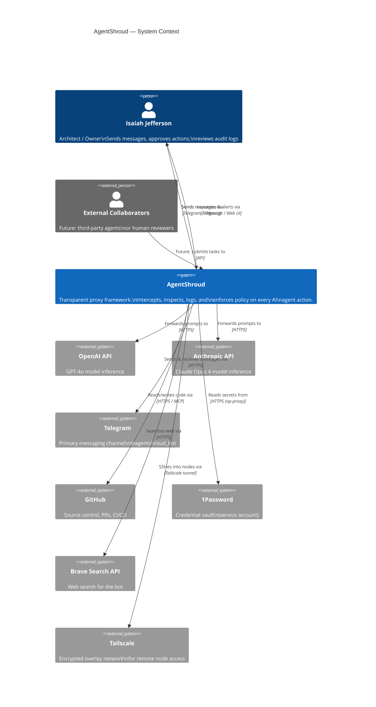
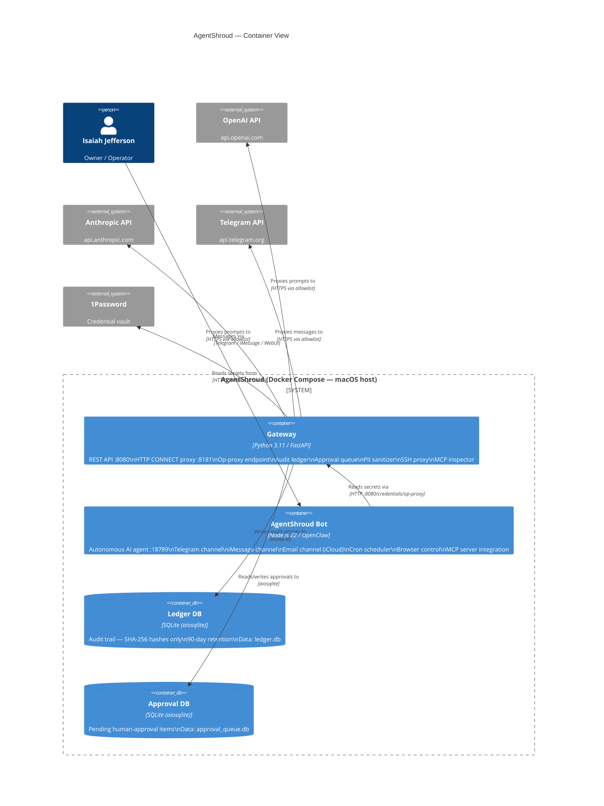
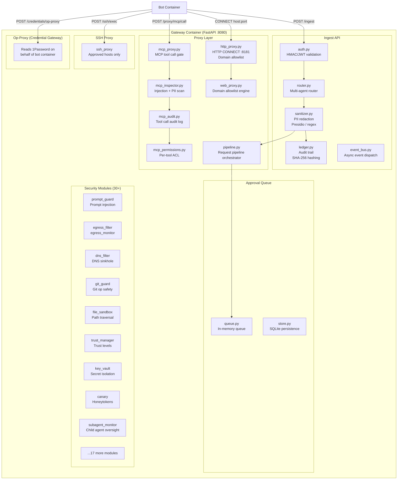

# AgentShroud — Architecture Diagrams

> AgentShroud™ is a trademark of Isaiah Jefferson · All rights reserved

---

## 1. C4 Level 0 — Context Diagram (Executive View)

Single-page view of the system as a black box with all external actors.

---

## 2. C4 Level 1 — Container Diagram

Internal containers and how they communicate.

---

## 3. Architecture Component Diagram — Gateway internals

