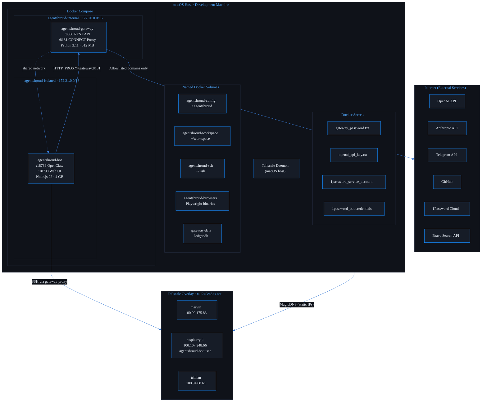
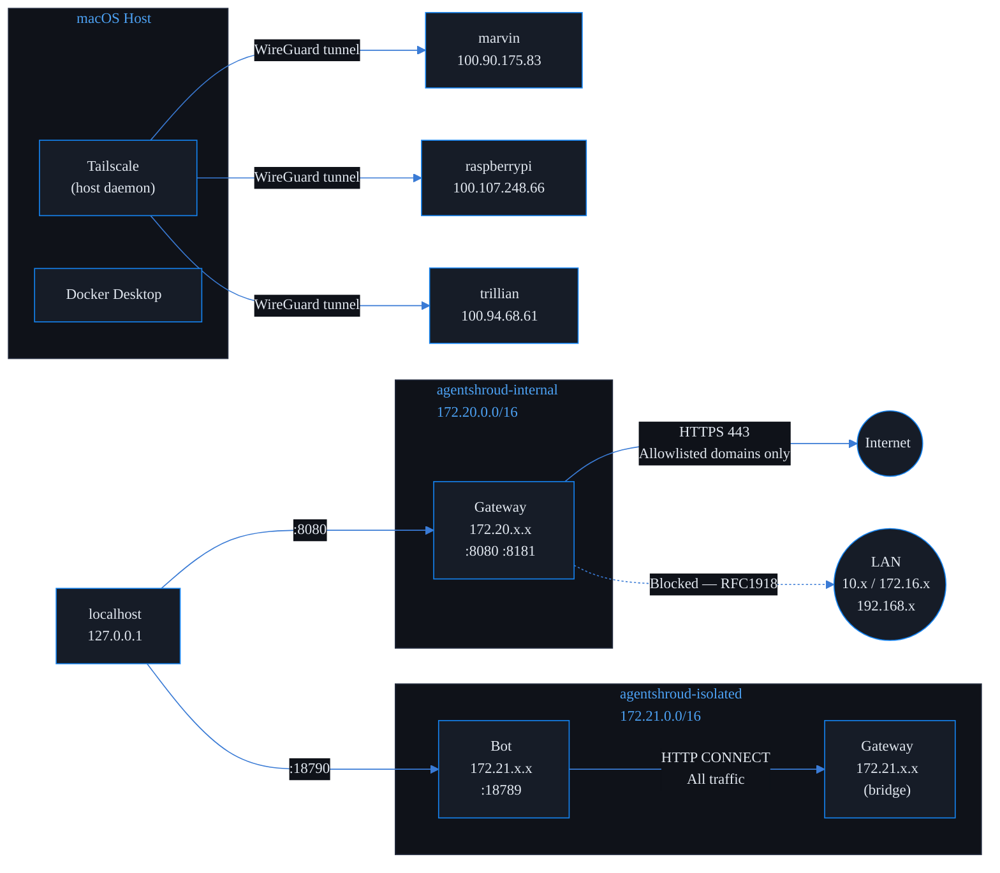
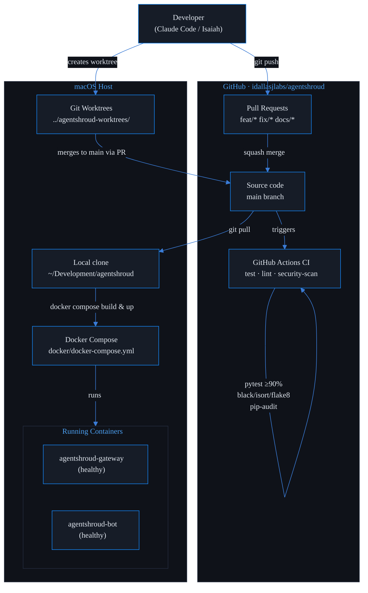

# AgentShroud — Infrastructure & Network Diagrams

> AgentShroud™ is a trademark of Isaiah Jefferson · All rights reserved

---

## 4. Infrastructure Diagram — Hosting & Servers

---

## 5. Network Topology Diagram

---

## 6. Deployment Diagram — What Runs Where

