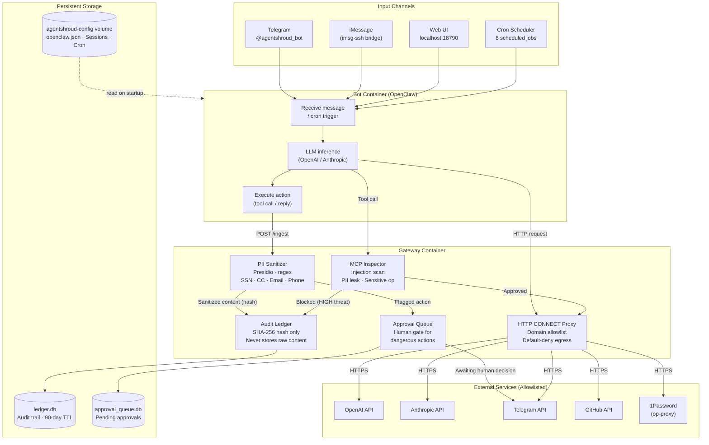
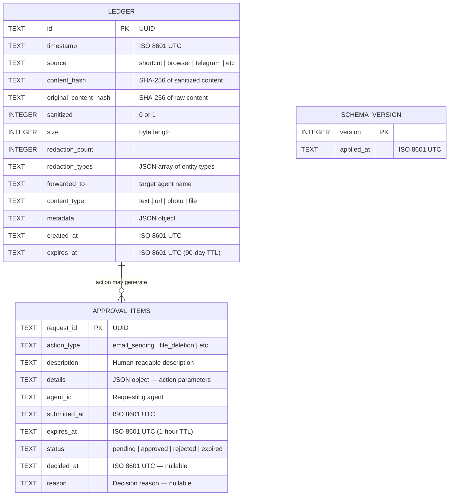
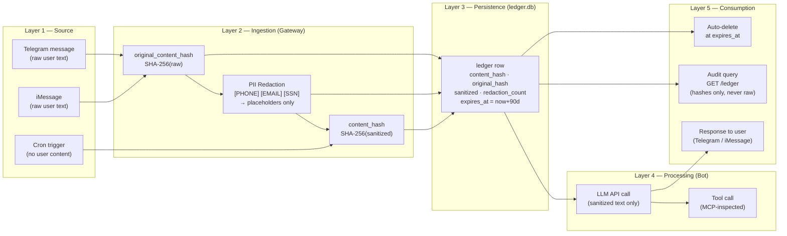
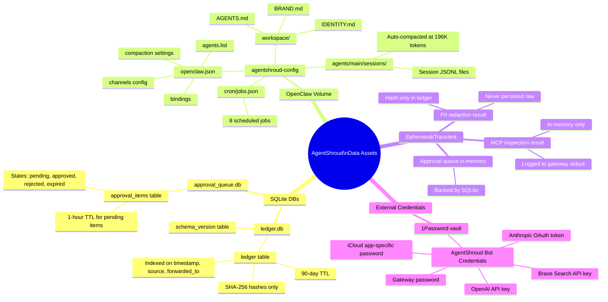

# AgentShroud — Data Diagrams

> AgentShroud™ is a trademark of Isaiah Jefferson · All rights reserved

---

## 7. Data Flow Diagram — How Data Moves Through the System

---

## 8. Entity Relationship Diagram (ERD)

---

## 9. Data Lineage Diagram

End-to-end traceability from source to consumption.

---

## 10. Data Dictionary / Catalog Map

