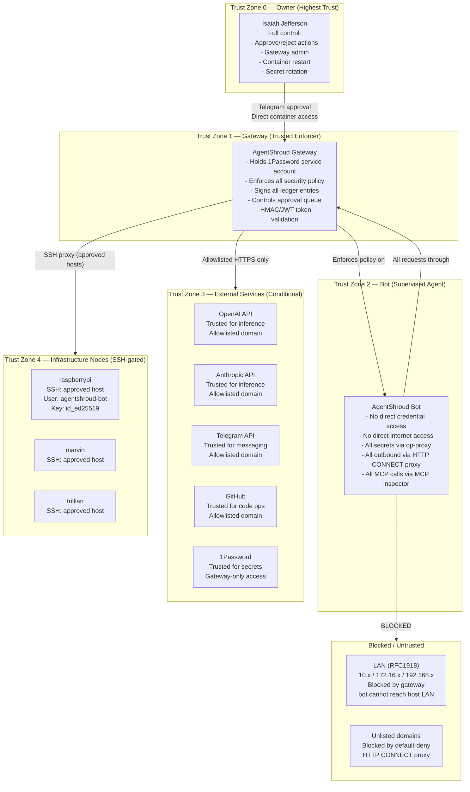
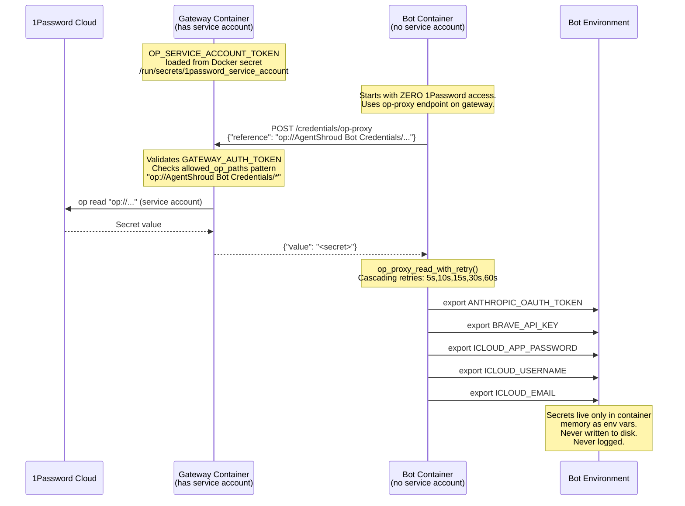
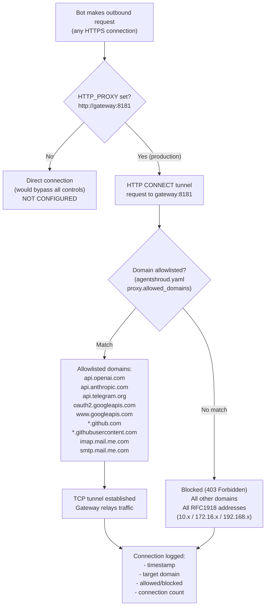

# AgentShroud — Security & Access Diagrams

> AgentShroud™ is a trademark of Isaiah Jefferson · All rights reserved

---

## 11. Trust Boundary Diagram

---

## 12. Credential Flow Diagram

How secrets are managed and reach the bot.

---

## 13. Network Security Diagram — Egress Controls

