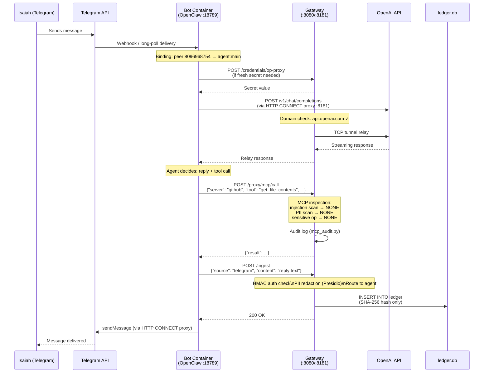
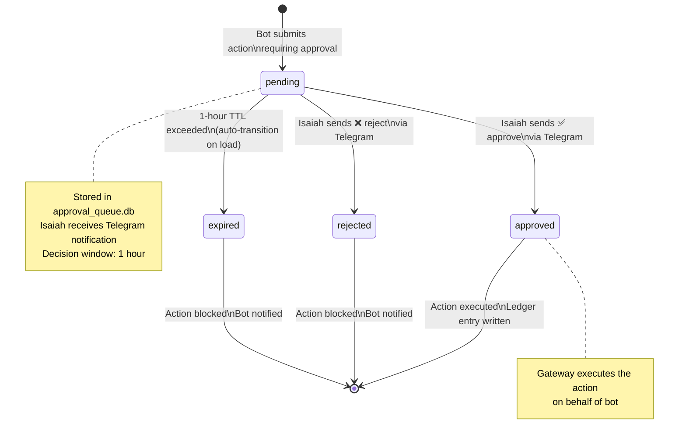
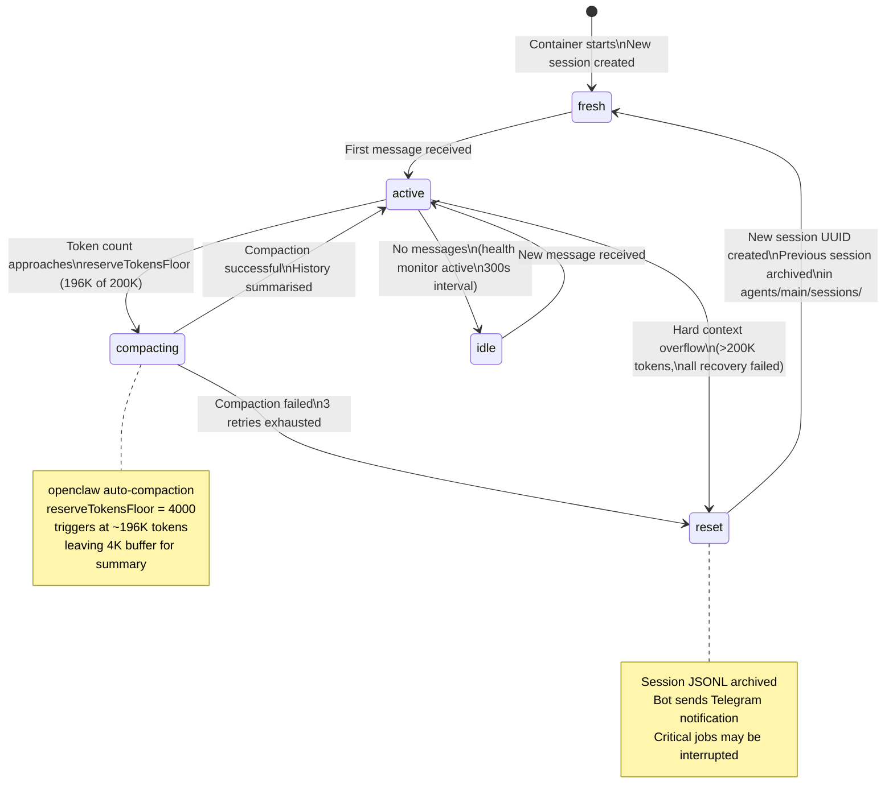

# AgentShroud — System Behavior Diagrams

> AgentShroud™ is a trademark of Isaiah Jefferson · All rights reserved

---

## 14. Logic Flow / Flowchart — Request Execution

```mermaid
flowchart TD
    START(["User sends message\nor cron fires"])

    RECV["Bot receives event\n(Telegram / iMessage / Web / Cron)"]

    ROUTE{"Route to agent?\n(bindings config)"}
    MAIN["Main agent\n(agentshroud_bot)"]

    LLM_CALL["LLM inference\n(OpenAI GPT-4o\nor Anthropic Claude)"]

    DECIDE{"Agent decides\nnext action"}

    REPLY_ONLY["Send reply to user"]

    TOOL_CALL["Issue tool call\n(MCP server)"]

    MCP_INSPECT["MCP Inspector\ninjection scan\nPII scan\nsensitive op scan"]

    THREAT{"Threat level?"}
    NONE_LOW["NONE / LOW\nAllow + log"]
    MEDIUM["MEDIUM\nAllow + audit flag"]
    HIGH_THREAT["HIGH\nBlock + alert Isaiah"]

    APPROVAL_CHECK{"Action type\nrequires approval?\n(email_sending\nfile_deletion\nexternal_api_calls\nskill_installation)"]

    QUEUE_ITEM["Add to approval queue\nNotify Isaiah via Telegram\nWait up to 1 hour"]

    DECISION{"Isaiah decides"}
    APPROVED["Approved\nExecute action"]
    REJECTED["Rejected\nLog + notify bot"]
    EXPIRED["Expired (1h timeout)\nAuto-reject"]

    EXECUTE["Execute action\nvia HTTP CONNECT proxy"]

    LEDGER["Write audit entry\nto ledger.db\n(SHA-256 hash only)"]

    END(["Response delivered\nto user"])

    START --> RECV
    RECV --> ROUTE
    ROUTE -->|"Telegram ID 8096968754 → main"| MAIN
    MAIN --> LLM_CALL
    LLM_CALL --> DECIDE

    DECIDE -->|"Direct reply"| REPLY_ONLY
    DECIDE -->|"Tool call"| TOOL_CALL

    TOOL_CALL --> MCP_INSPECT
    MCP_INSPECT --> THREAT

    THREAT -->|"NONE/LOW"| NONE_LOW
    THREAT -->|"MEDIUM"| MEDIUM
    THREAT -->|"HIGH"| HIGH_THREAT

    NONE_LOW --> APPROVAL_CHECK
    MEDIUM --> APPROVAL_CHECK
    HIGH_THREAT --> LEDGER

    APPROVAL_CHECK -->|"No approval needed"| EXECUTE
    APPROVAL_CHECK -->|"Approval needed"| QUEUE_ITEM

    QUEUE_ITEM --> DECISION
    DECISION -->|"✅ Approved"| APPROVED
    DECISION -->|"❌ Rejected"| REJECTED
    DECISION -->|"⏱️ Timeout"| EXPIRED

    APPROVED --> EXECUTE
    REJECTED --> LEDGER
    EXPIRED --> LEDGER
    EXECUTE --> LEDGER
    REPLY_ONLY --> LEDGER
    LEDGER --> END
```

---

## 15. Sequence Diagram — Telegram Message to Response

Time-ordered interactions with exact message passing.



---

## 16. State Machine Diagram — Approval Queue Item Lifecycle



---

## 17. State Machine — Bot Session / Context Lifecycle


