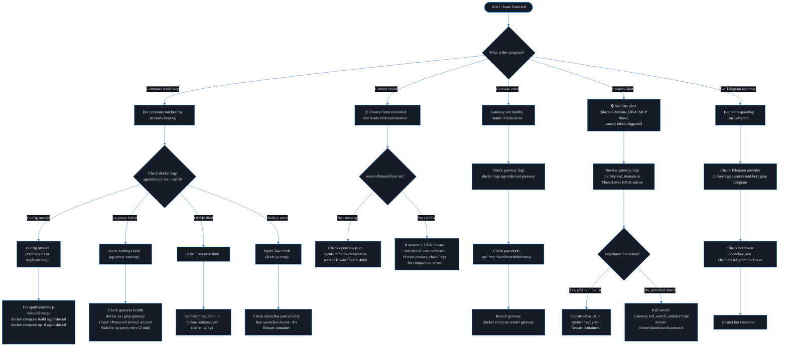
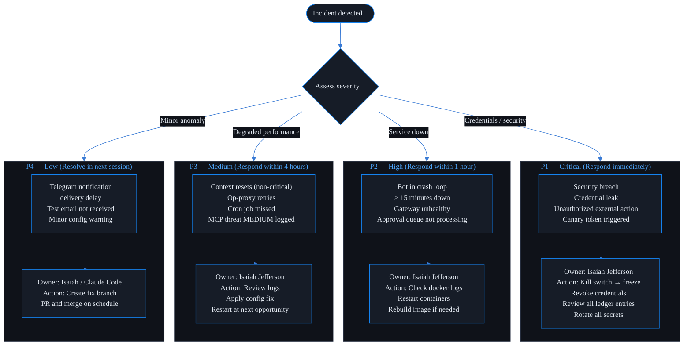
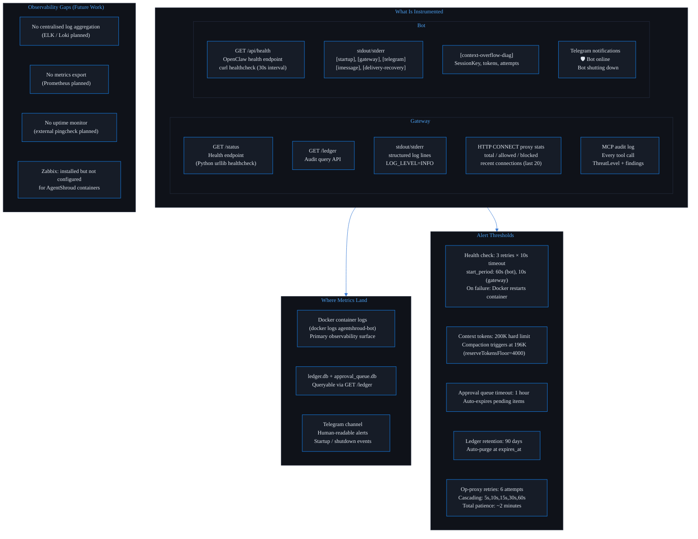

# AgentShroud — Operations & Reliability Diagrams

> AgentShroud™ is a trademark of Isaiah Jefferson · All rights reserved

---

## 18. Runbook / Decision Tree — On-Call Logic

---

## 19. Incident Response Flow — Severity & Escalation

---

## 20. Monitoring & Observability Map

