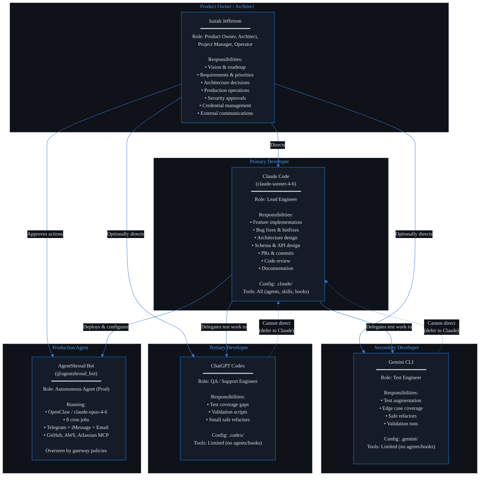
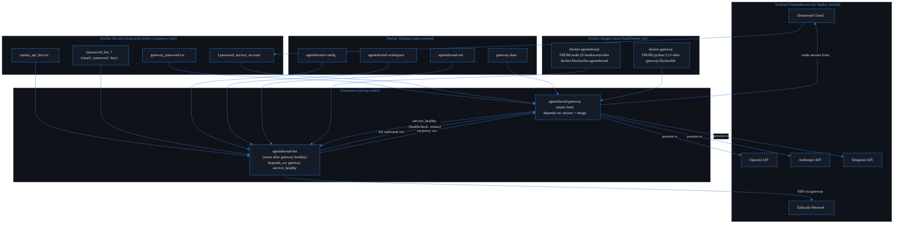
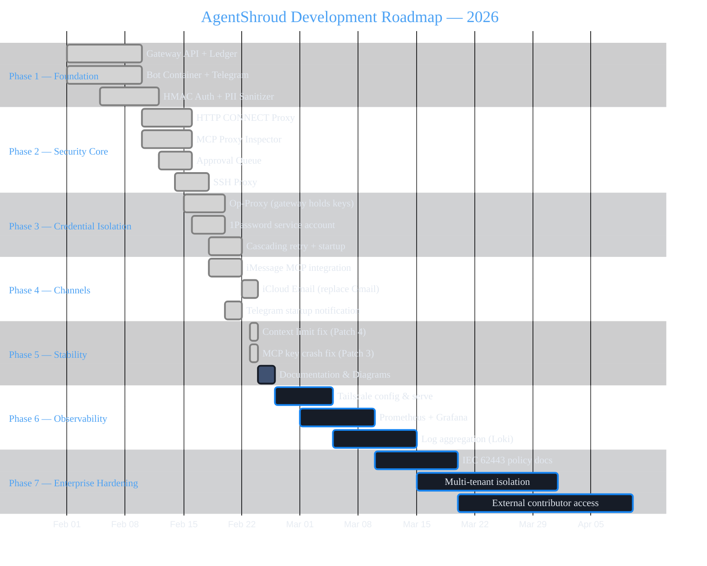

# AgentShroud — Team, Planning & Dependency Diagrams

> AgentShroud™ is a trademark of Isaiah Jefferson · All rights reserved

---

## 21. Agile Team Diagram — Structure & Roles

---

## 22. Dependency Graph — Component Dependencies

Safe deployment order: components lower in the graph must be deployed first.

---

## 23. Roadmap / Timeline — Development Phases

