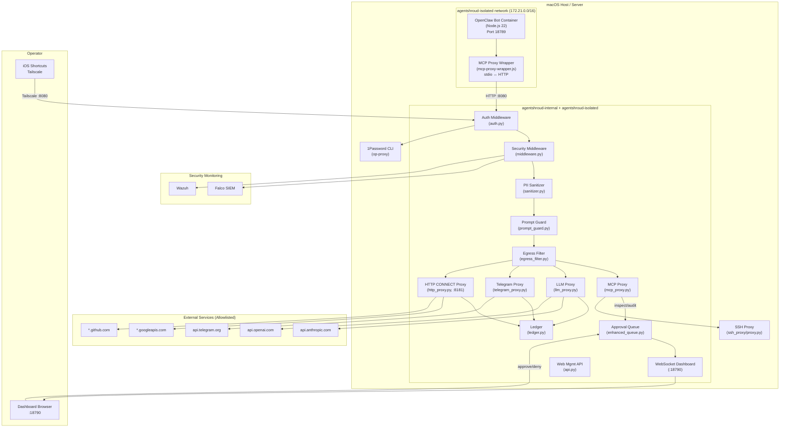

# Architecture Overview

## Summary

AgentShroud is a dual-container security architecture: an **OpenClaw bot container** (Node.js 22) and an **AgentShroud gateway container** (Python 3.13 / FastAPI). The bot container has no direct internet access; all outbound traffic routes through the gateway's security pipeline first.

---

## Full System Diagram



---

## Container Architecture

### Gateway Container (`agentshroud-gateway`)

| Property | Value |
|----------|-------|
| Image | `gateway/Dockerfile` (Python 3.13, multi-stage) |
| Port exposed | `127.0.0.1:8080:8080` |
| Networks | `agentshroud-internal` + `agentshroud-isolated` |
| Memory limit | 1280 MB |
| CPU limit | 1.0 |
| PIDs limit | 100 |
| Root filesystem | Read-only |
| Security opts | `no-new-privileges`, seccomp profile |
| Capabilities | ALL dropped |

**Volumes:**
- `agentshroud.yaml` → `/app/agentshroud.yaml` (read-only)
- `gateway-data` → `/app/data` (ledger database)
- `agentshroud-ssh` → `/var/agentshroud-ssh` (read-only, SSH keys)
- `agentshroud-workspace` → `/data/bot-workspace` (read-only)

### Bot Container (`agentshroud-bot`)

| Property | Value |
|----------|-------|
| Image | `docker/Dockerfile.agentshroud` (Node.js 22) |
| Port exposed | `127.0.0.1:18790:18789` |
| Network | `agentshroud-isolated` only |
| Memory limit | 4 GB |
| CPU limit | 2.0 |
| PIDs limit | 512 |
| Root filesystem | Read-only |
| Security opts | `no-new-privileges`, seccomp profile |
| Capabilities | ALL dropped |

**Volumes:**
- `agentshroud-config` → `/home/node/.agentshroud` (config, API keys, memory)
- `agentshroud-workspace` → `/home/node/agentshroud/workspace` (agent work files)
- `agentshroud-ssh` → `/home/node/.ssh` (generated SSH keys)
- `agentshroud-browsers` → Playwright browser binaries

---

## Network Topology

```
agentshroud-internal (172.20.0.0/16)
  └── Gateway ← accessible from localhost (host machine)
  └── Operator dashboard, iOS Shortcuts via Tailscale

agentshroud-isolated (172.21.0.0/16)
  └── Bot container (NO direct internet — goes through gateway)
  └── Gateway (bridges both networks)
```

> **Note:** `internal: false` on `agentshroud-isolated` is a Docker Desktop compatibility
> workaround. Bot internet isolation is enforced at the application layer via
> `HTTP_PROXY=http://gateway:8181` and `ANTHROPIC_BASE_URL=http://gateway:8080`.

---

## Gateway Internal Layer Order

When a request arrives at the gateway, it passes through these layers **in order**:

1. `MiddlewareManager` — Auth, rate limiting, logging
2. `PIISanitizer` — Presidio/spaCy PII detection and redaction
3. `PromptGuard` — Prompt injection detection and threat scoring
4. `EgressFilter` — Domain/IP allowlist enforcement
5. `SecurityPipeline` — Orchestrates all security module checks
6. **Proxy routing:**
   - MCP calls → `MCPProxy`
   - LLM calls → `LLMProxy`
   - Telegram calls → `TelegramAPIProxy`
   - HTTP CONNECT → `HTTPConnectProxy` (port 8181)
   - Web content → `WebProxy`
7. `DataLedger` — SHA-256 hash-chained audit record
8. `ApprovalQueue` — Human-in-the-loop for risky actions

---

## Related Notes

- [[System Overview]] — Why this architecture was chosen
- [[Data Flow]] — Step-by-step request trace
- [[Startup Sequence]] — Boot order and initialization
- [[Containers & Services/agentshroud-gateway]] — Gateway container details
- [[Containers & Services/agentshroud-bot]] — Bot container details
- [[Containers & Services/networks]] — Network configuration details
- [[Diagrams/Full System Flowchart]] — Standalone diagram
