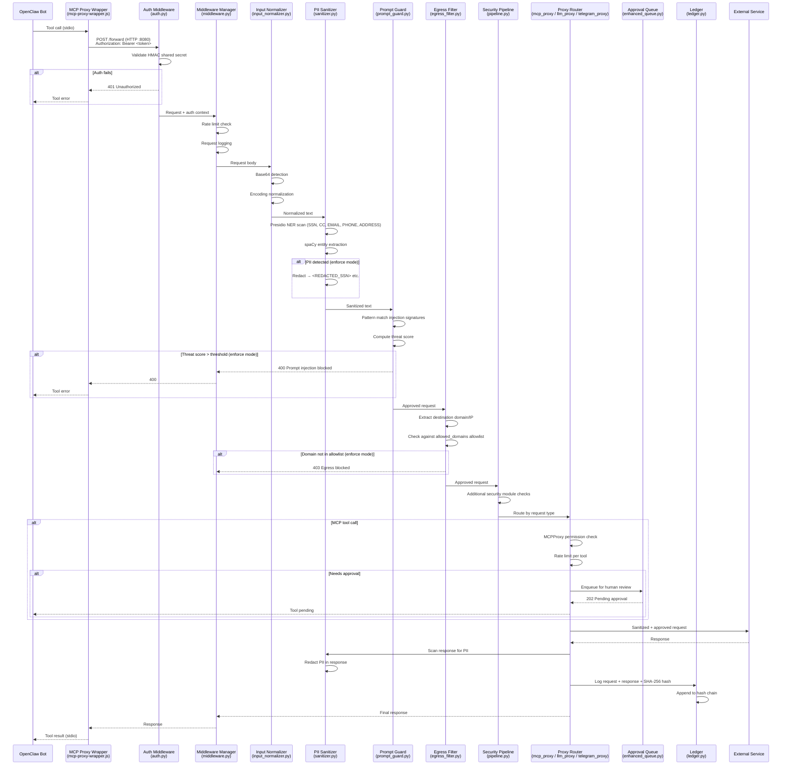

# Data Flow

## Overview

This document traces a request from the OpenClaw bot to the external destination, showing every security layer the request passes through in the AgentShroud gateway.

---

## Request Flow Diagram

---

## Layer-by-Layer Breakdown

### 1. MCP Proxy Wrapper (Bot Side)

**File:** `docker/scripts/mcp-proxy-wrapper.js`

The bot's MCP tool calls are intercepted by this Node.js stdio proxy before leaving the container. It translates between the agent's stdio protocol and HTTP calls to the gateway.

- **Protocol:** stdio ↔ HTTP POST to `http://gateway:8080`
- **Headers added:** `Authorization: Bearer <GATEWAY_PASSWORD>`, `Content-Type: application/json`
- **Fail-closed:** If gateway is unreachable, tool call returns an error (does NOT pass through)

### 2. Authentication (Gateway Entry)

**File:** `gateway/ingest_api/auth.py`

- Validates `Authorization: Bearer <token>` header using HMAC constant-time comparison
- Source: `GATEWAY_AUTH_TOKEN_FILE` (Docker secret) or `auth_token` in `agentshroud.yaml`
- Returns 401 on any mismatch — no retry, no fallback

### 3. Middleware Manager

**File:** `gateway/ingest_api/middleware.py`

Runs in-order middleware stack:
1. Request logging (structured JSON)
2. Rate limiting (per-client, per-endpoint)
3. Security headers injection (`X-Content-Type-Options`, `X-Frame-Options`, `HSTS`)
4. CORS enforcement (only configured `cors_origins`)

### 4. Input Normalization

**File:** `gateway/security/input_normalizer.py`

- Detects base64-encoded payloads and decodes for inspection
- Normalizes Unicode encodings (prevents encoding-based bypass)
- Strips null bytes and control characters

### 5. PII Sanitization

**File:** `gateway/ingest_api/sanitizer.py`

- **Engine:** Presidio `AnalyzerEngine` + `AnonymizerEngine`
- **Entities detected:** SSN, CREDIT_CARD, PHONE_NUMBER, EMAIL_ADDRESS, LOCATION
- **Confidence threshold:** 0.9 (configured in `agentshroud.yaml`)
- **Mode:** `enforce` → redact; `monitor` → log only
- **Redaction tokens:** `<REDACTED_SSN>`, `<REDACTED_CREDIT_CARD>`, `<REDACTED_EMAIL>`, etc.
- **Also scans:** Tool call results (via `tool_result_sanitizer.py`)

### 6. Prompt Injection Defense

**File:** `gateway/security/prompt_guard.py`

- Pattern-based detection of injection signatures (role switching, instruction override, etc.)
- Threat scoring (0.0–1.0); blocks at threshold (configurable)
- Scans: message content, tool names, tool arguments, tool results
- Mode: `enforce` → block; `monitor` → log only

### 7. Egress Filter

**File:** `gateway/security/egress_filter.py`

- Domain allowlist from `agentshroud.yaml` `proxy.allowed_domains`
- Default-deny: any domain not listed is blocked
- RFC1918 (10.x, 172.16–31.x, 192.168.x) always blocked
- Wildcard support: `*.github.com` matches all subdomains
- Mode: `enforce` → block; `monitor` → log only

### 8. Security Pipeline

**File:** `gateway/proxy/pipeline.py`

Orchestrates additional security checks:
- Context leakage detection (`context_guard.py`)
- Tool chain analysis (`tool_chain_analyzer.py`)
- Outbound information filter (`outbound_filter.py`)
- Trust score check (`trust_manager.py`)

### 9. Proxy Routing

Based on request type:

| Request Type | Handler | Port |
|-------------|---------|------|
| MCP tool call | `mcp_proxy.py` | 8080 |
| LLM API call | `llm_proxy.py` | 8080 |
| Telegram API | `telegram_proxy.py` | 8080 |
| HTTP CONNECT | `http_proxy.py` | 8181 |
| Web content | `web_proxy.py` | 8080 |

### 10. Approval Queue

**File:** `gateway/approval_queue/enhanced_queue.py`

Actions requiring human approval (configured in `agentshroud.yaml`):
- `email_sending`
- `file_deletion`
- `external_api_calls`
- `skill_installation`

Request is held until operator approves/denies via WebSocket dashboard.

### 11. Ledger Recording

**File:** `gateway/ingest_api/ledger.py`

Every forwarded request is logged:
- Timestamp, agent ID, endpoint, sanitized content
- SHA-256 hash of content
- Hash chain (each entry includes hash of previous entry)
- Stored in SQLite at `gateway-data:/app/data/ledger.db`
- Retention: 90 days (configured)

---

## Response Path

The response follows the reverse path:
1. External service → Proxy
2. Proxy → PII scan on response body
3. Proxy → Ledger log
4. Proxy → Middleware (headers)
5. Response → Bot container
6. Bot container → MCP wrapper → OpenClaw tool result

---

## Related Notes

- [[Architecture Overview]] — Component map
- [[Proxy Layer/pipeline.py]] — Security pipeline implementation
- [[Gateway Core/sanitizer.py]] — PII sanitizer details
- [[Security Modules/prompt_guard.py]] — Prompt injection detection
- [[Security Modules/egress_filter.py]] — Egress filter details
- [[Gateway Core/ledger.py]] — Audit ledger
- [[Diagrams/Security Pipeline Flow]] — Visual diagram
