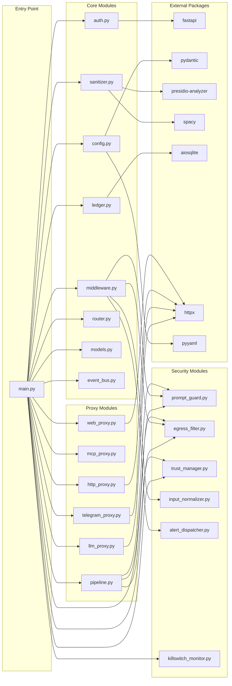
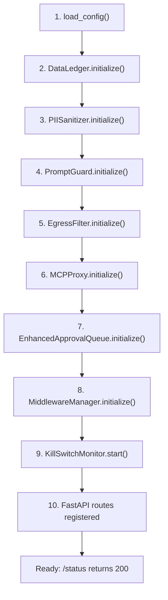
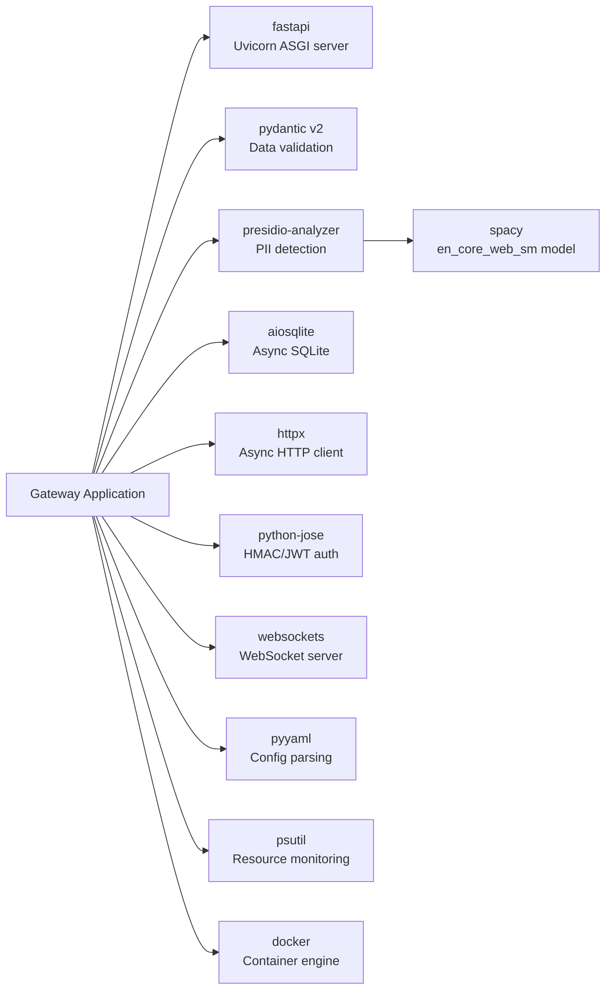

# Dependency Graph

## Gateway Module Dependencies

---

## Key Initialization Order (main.py lifespan)

---

## Python Package Dependencies

---

## Related Notes

- [[Architecture Overview]] — System-level component view
- [[Dependencies/All Dependencies]] — Dependency details
- [[Gateway Core/main.py|main.py]] — Entry point that imports everything
