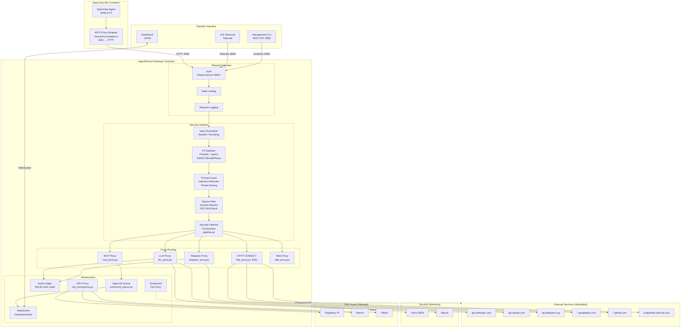

# Full System Flowchart

![[Architecture Overview#Full System Diagram]]

## Complete System Diagram

---

## Legend

| Symbol | Meaning |
|--------|---------|
| Solid arrow → | Normal request flow |
| Dashed arrow -.-> | Optional / monitoring flow |
| Box border (thick) | Container boundary |
| Subgraph | Logical grouping within container |

---

## Related Notes

- [[Architecture Overview]] — Narrative description of this diagram
- [[Data Flow]] — Step-by-step request trace
- [[Diagrams/Security Pipeline Flow]] — Security layer detail
- [[Diagrams/Network Topology]] — Network-focused view
