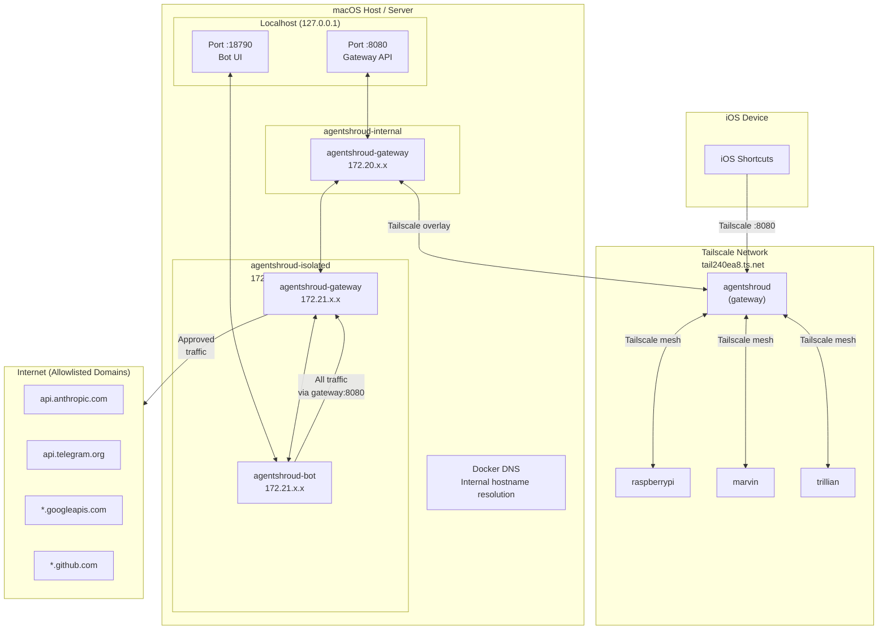

# Network Topology

## Container Network Diagram

---

## Hostname Resolution

| Hostname | Resolves To | Used By |
|----------|------------|---------|
| `gateway` | `172.21.x.x` (Docker DNS) | Bot container |
| `agentshroud` | `172.21.x.x` (Docker DNS) | Gateway (to reach bot) |
| `host.docker.internal` | `host-gateway` (macOS host) | Bot → MCP servers on host |
| `raspberrypi.tail240ea8.ts.net` | Tailscale IP | SSH proxy |
| `marvin.tail240ea8.ts.net` | Tailscale IP | SSH proxy |
| `trillian.tail240ea8.ts.net` | Tailscale IP | SSH proxy |

---

## Traffic Routing

| Traffic | Path |
|---------|------|
| Bot → LLM API | Bot → `http://gateway:8080` → Gateway → `api.anthropic.com` |
| Bot → Telegram | Bot → `http://gateway:8080/telegram-api` → Gateway → `api.telegram.org` |
| Bot → MCP tools | Bot → `http://gateway:8080` → Gateway → MCP server |
| Bot → SSH host | Bot → `http://gateway:8080/ssh-proxy` → Gateway → SSH host (Tailscale) |
| iOS Shortcuts → API | iPhone → Tailscale → `agentshroud.tail*:8080` → Gateway |
| Dashboard → WebSocket | Browser → `localhost:18790` → Bot → `localhost:8080/ws` |

---

## Network Security Notes

1. **agentshroud-isolated** network: Bot has no path to internet except through gateway
2. **agentshroud-internal** network: Gateway is accessible from localhost only (not LAN)
3. **RFC1918 blocking**: Gateway's egress filter blocks all private network destinations
4. **Port exposure**: Only `127.0.0.1:8080` and `127.0.0.1:18790` are exposed to host
5. **Tailscale**: Provides authenticated encrypted overlay for remote access and SSH

---

## Related Notes

- [[Containers & Services/networks]] — Docker network definitions
- [[Configuration/docker-compose.yml]] — Network configuration
- [[Architecture Overview]] — System component diagram
