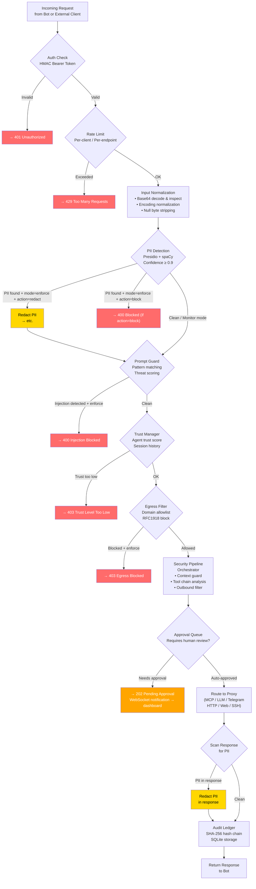

# Security Pipeline Flow

## Overview

This diagram shows the security layers a request passes through in order. Each layer can either pass the request forward, block it (enforce mode), or log and pass (monitor mode).

---

## Layer Reference

| Layer | File | Default Mode | Block Code |
|-------|------|-------------|-----------|
| Auth | `auth.py` | Always enforce | 401 |
| Rate Limit | `middleware.py` | Always enforce | 429 |
| Input Norm | `input_normalizer.py` | Always | N/A |
| PII Sanitizer | `sanitizer.py` | Enforce (redact) | N/A (redacts) |
| Prompt Guard | `prompt_guard.py` | Enforce | 400 |
| Trust Manager | `trust_manager.py` | Enforce | 403 |
| Egress Filter | `egress_filter.py` | Enforce | 403 |
| Security Pipeline | `pipeline.py` | Enforce | 400/403 |
| Approval Queue | `enhanced_queue.py` | Enforce | 202 (wait) |

---

## Monitor Mode

When `AGENTSHROUD_MODE=monitor` (or per-module `mode: monitor`):
- Red failure paths become logs
- Request passes through
- Security events are recorded but not enforced

---

## Related Notes

- [[Data Flow]] — Narrative sequence diagram
- [[Proxy Layer/pipeline.py|pipeline.py]] — Pipeline orchestrator
- [[Architecture Overview]] — System-level view
- [[Diagrams/Full System Flowchart]] — Complete system diagram
