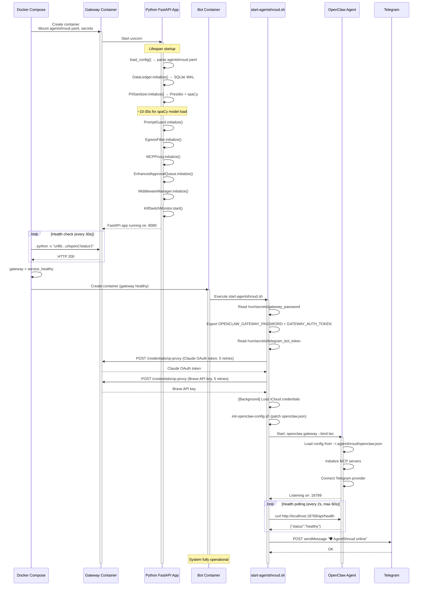

# Startup Flow Diagram

---

## Related Notes

- [[Startup Sequence]] — Numbered startup steps
- [[Shutdown & Recovery]] — Reverse sequence
- [[Containers & Services/agentshroud-gateway]] — Gateway container
- [[Containers & Services/agentshroud-bot]] — Bot container
